### Node.Js Interview questions

We Will use this as a point of reference to study node Js InterView Questions 

[Node.js - Top 100 Interview Questions and Answers - YouTube](https://youtu.be/Nz-nPR5YJbw).

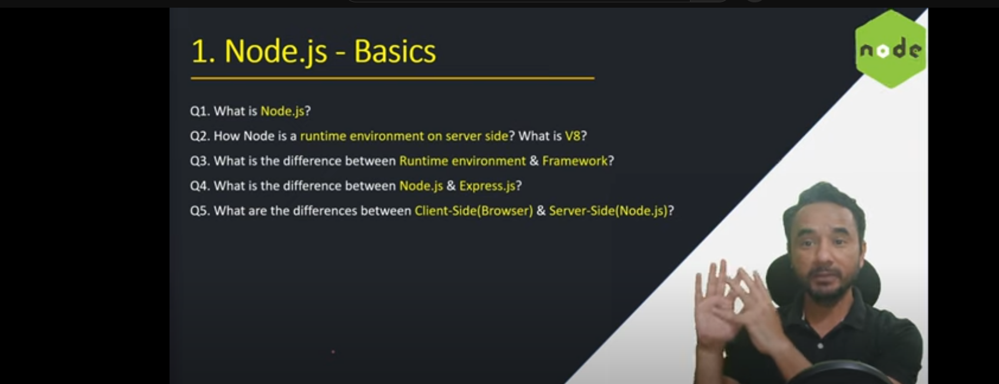

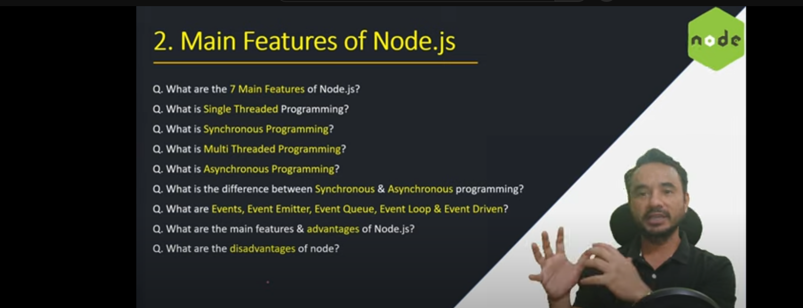

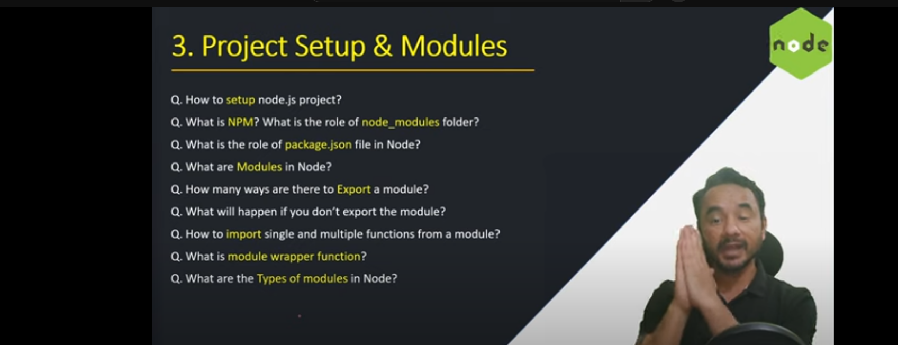

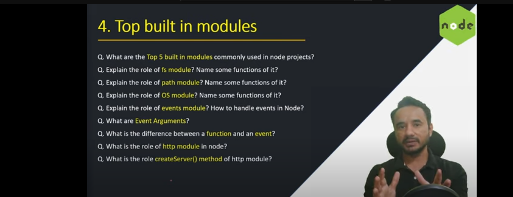

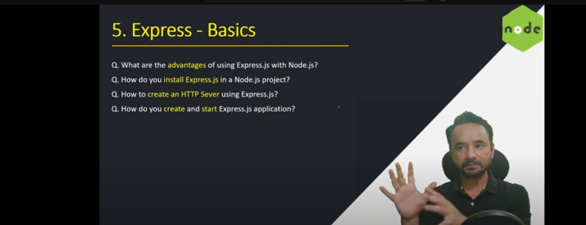

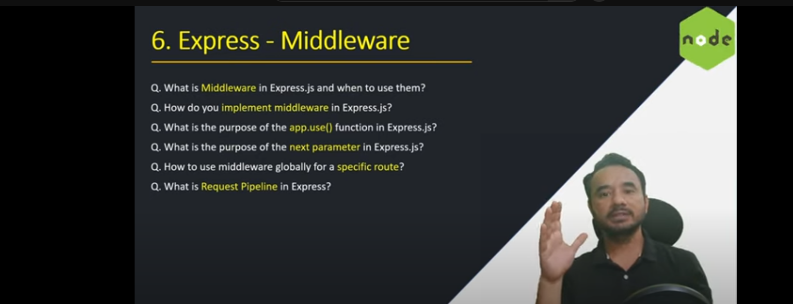

                                                                                                                                              

# 

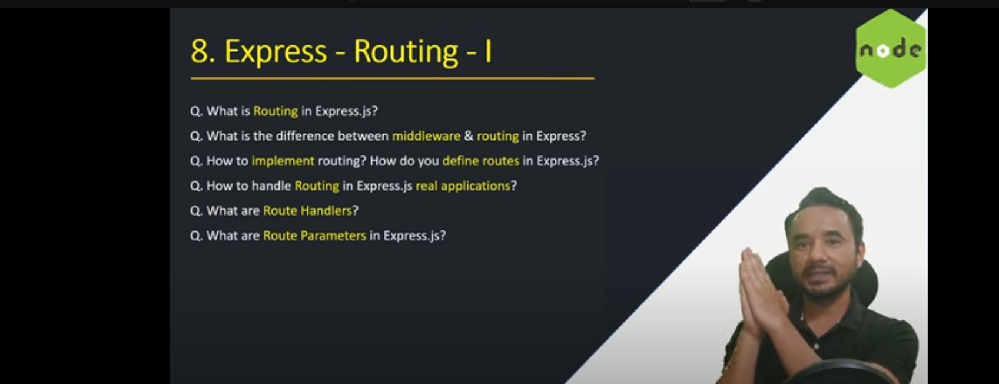

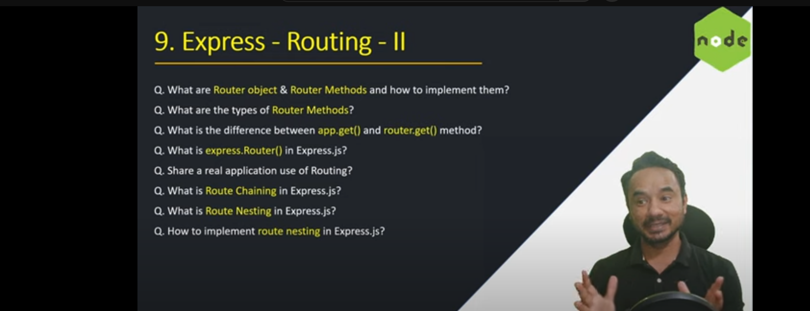

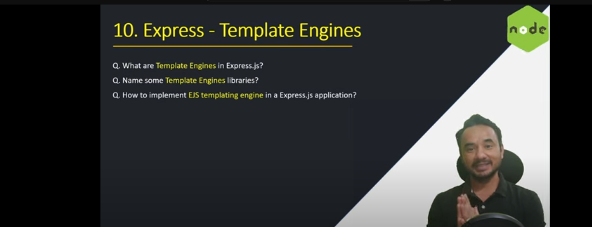

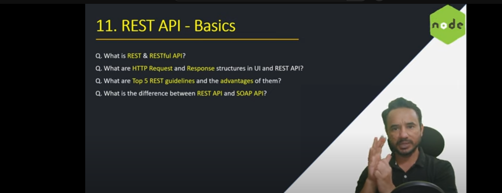

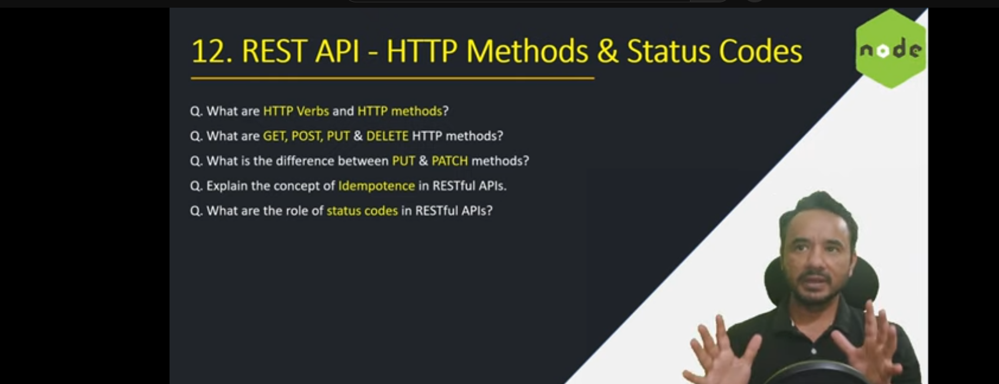

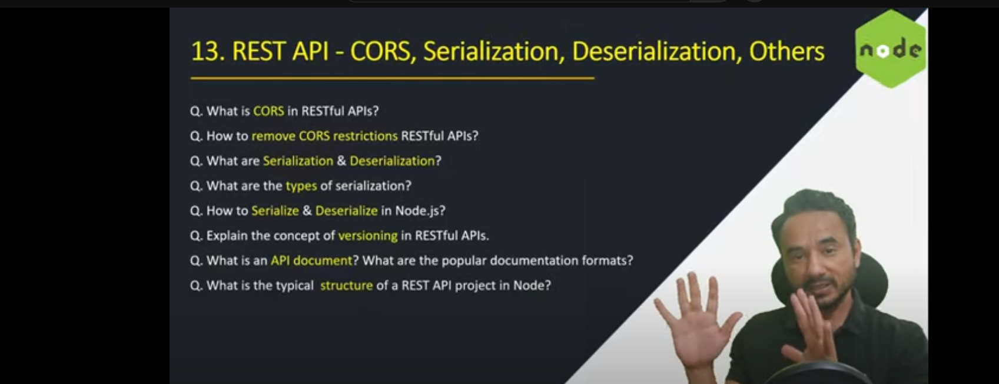

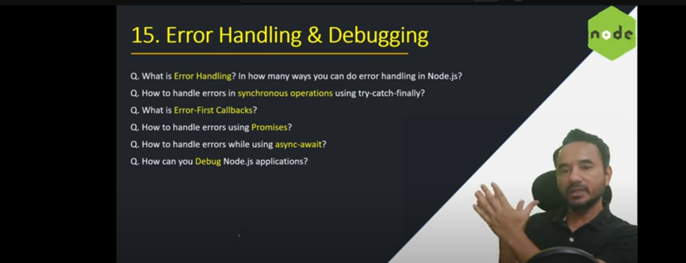
