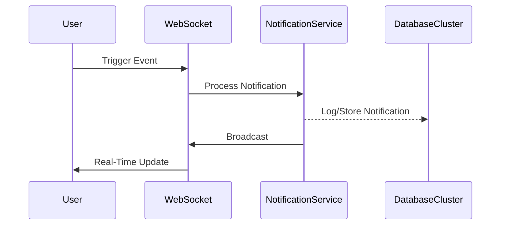
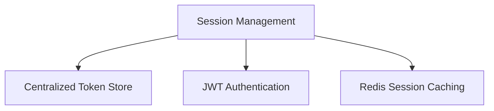
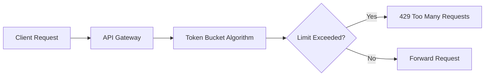
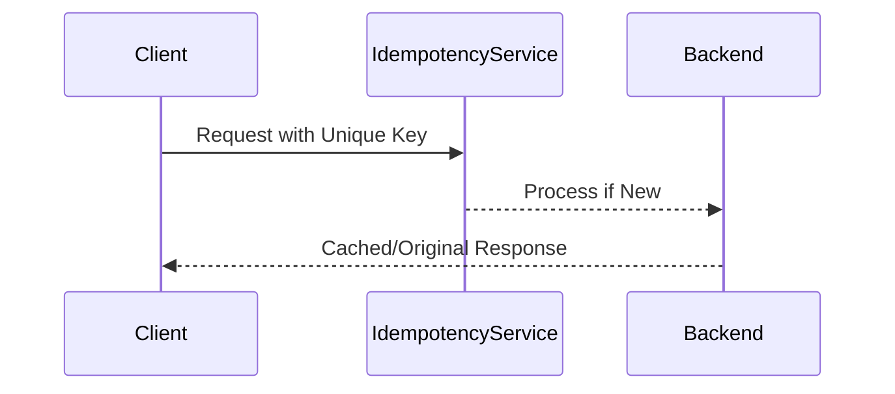
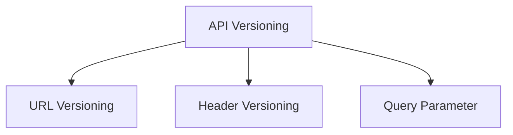
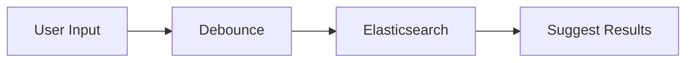
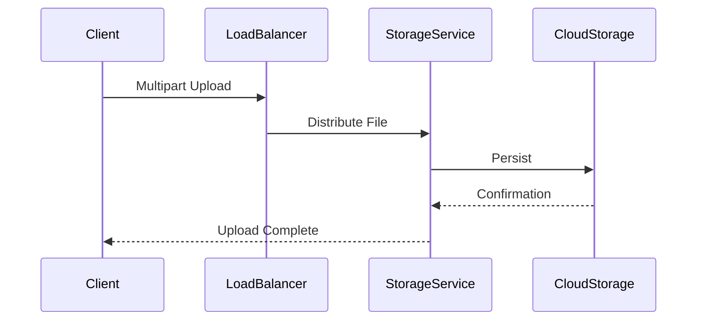
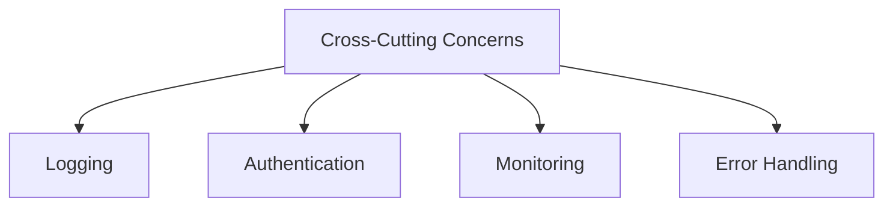

# Advanced FullStack and React Performance Techniques

## Part 1: Full-Stack Concepts

### 1. Real-Time Notification System Architecture

**Overview**: A robust real-time notification system requires efficient event propagation, scalable infrastructure, and low-latency communication.



### Implementation Strategy
```javascript
class NotificationManager {
  constructor() {
    this.socketServer = io();
    this.subscribeToEvents();
  }

  subscribeToEvents() {
    this.socketServer.on('notification', this.handleNotification);
  }

  handleNotification(data) {
    // Dispatch to appropriate channels
    this.broadcastToClients(data);
    this.persistNotification(data);
  }
}
```

### 2. Distributed Session Management

**Overview**: Distributed sessions require centralized state management and secure token-based authentication.



### Redis-Based Session Implementation
```javascript
const RedisStore = require('connect-redis')(session);
const redisClient = redis.createClient();

app.use(session({
  store: new RedisStore({ client: redisClient }),
  secret: 'complex-secret',
  resave: false
}));
```

### 3. Rate Limiting Across Services

**Overview**: Implement distributed rate limiting to prevent service abuse and ensure system stability.



### Distributed Rate Limiter
```javascript
const rateLimit = require('express-rate-limit');

const apiLimiter = rateLimit({
  windowMs: 15 * 60 * 1000, // 15 minutes
  max: 100, // Limit each IP
  message: 'Too many requests'
});
```

### 4. API Idempotency Handling

**Overview**: Ensure consistent API behavior by tracking and preventing duplicate requests.



### Idempotency Key Implementation
```javascript
function handleRequest(req, res) {
  const idempotencyKey = req.headers['x-idempotency-key'];
  const cachedResponse = cache.get(idempotencyKey);

  if (cachedResponse) {
    return res.json(cachedResponse);
  }

  // Process request and cache response
}
```

### 5. API Versioning Strategies

**Overview**: Manage API evolution through structured versioning mechanisms.



### Versioning Middleware
```javascript
function apiVersion(req, res, next) {
  const version = req.get('Accept-Version') || 'v1';
  req.apiVersion = version;
  next();
}
```

### 6. Autocomplete Search Feature

**Overview**: Implement efficient, low-latency search with intelligent indexing.



### Search Implementation
```javascript
async function searchAutocomplete(query) {
  return await ElasticsearchClient.search({
    index: 'products',
    body: {
      suggest: {
        productSuggester: {
          prefix: query,
          completion: { field: 'suggest' }
        }
      }
    }
  });
}
```

### 7. Distributed File Upload

**Overview**: Handle file uploads across multiple servers with consistent storage.



### Distributed Upload Handler
```javascript
const uploadMiddleware = multer({
  storage: multer.memoryStorage(),
  fileFilter: (req, file, cb) => {
    const allowedTypes = ['image/jpeg', 'image/png'];
    cb(null, allowedTypes.includes(file.mimetype));
  }
});
```

### 8. Microservices Cross-Cutting Concerns

**Overview**: Manage shared functionality across microservices.



### Middleware Example
```javascript
function globalMiddleware(req, res, next) {
  logger.info(`${req.method} ${req.path}`);
  performAuth(req);
  errorTracker.monitor(req);
  next();
}
```

## Part 2: React Performance Optimization

### 1. React.memo() Usage

**Overview**: Prevent unnecessary re-renders for functional components.

```javascript
const MemoizedComponent = React.memo(
  (props) => <div>{props.value}</div>,
  (prevProps, nextProps) => prevProps.value === nextProps.value
);
```

### 2. React.lazy() Implementation

**Overview**: Code-splitting for performance optimization.

```javascript
const LazyComponent = React.lazy(() => 
  import('./HeavyComponent')
);

function App() {
  return (
    <Suspense fallback={<div>Loading...</div>}>
      <LazyComponent />
    </Suspense>
  );
}
```

### 3. Key Prop Performance

**Overview**: Efficient list rendering and reconciliation.

```javascript
function UserList({ users }) {
  return (
    <ul>
      {users.map(user => (
        <li key={user.id}>{user.name}</li>
      ))}
    </ul>
  );
}
```

### 4. Context Optimization

**Overview**: Prevent unnecessary context re-renders.

```javascript
const Context = React.createContext();

function ContextProvider({ children }) {
  const [state, dispatch] = useReducer(reducer, initialState);
  
  const memoizedValue = useMemo(() => ({
    state, 
    dispatch
  }), [state]);

  return (
    <Context.Provider value={memoizedValue}>
      {children}
    </Context.Provider>
  );
}
```

### 5. Bundle Size Reduction

**Overview**: Optimize webpack configuration and imports.

```javascript
// webpack.config.js
module.exports = {
  optimization: {
    splitChunks: {
      chunks: 'all'
    }
  }
};
```

### 6. Infinite Scrolling

**Overview**: Efficient data loading with intersection observer.

```javascript
function InfiniteScroll({ fetchMore }) {
  const observer = useRef();
  const lastElementRef = useCallback(node => {
    if (observer.current) observer.current.disconnect();
    observer.current = new IntersectionObserver(entries => {
      if (entries[0].isIntersecting) {
        fetchMore();
      }
    });
    if (node) observer.current.observe(node);
  }, []);
}
```

### 7. CSS-in-JS Performance

**Overview**: Optimize runtime performance and styling.

```javascript
const styled = createStyled({
  shouldForwardProp: (prop) => !['margin', 'padding'].includes(prop)
});

const Box = styled('div', {
  compilerConfig: {
    shouldUseSingleQuote: true
  }
});
```

### 8. Image Optimization

**Overview**: Efficient image loading and rendering.

```javascript
function OptimizedImage({ src, alt }) {
  return (
    
  );
}
```
