# Advanced FullStack and React Performance Techniques

## Part 1: Full-Stack Concepts

### 1. Real-Time Notification System Architecture

**Overview**: A robust real-time notification system requires efficient event propagation, scalable infrastructure, and low-latency communication.

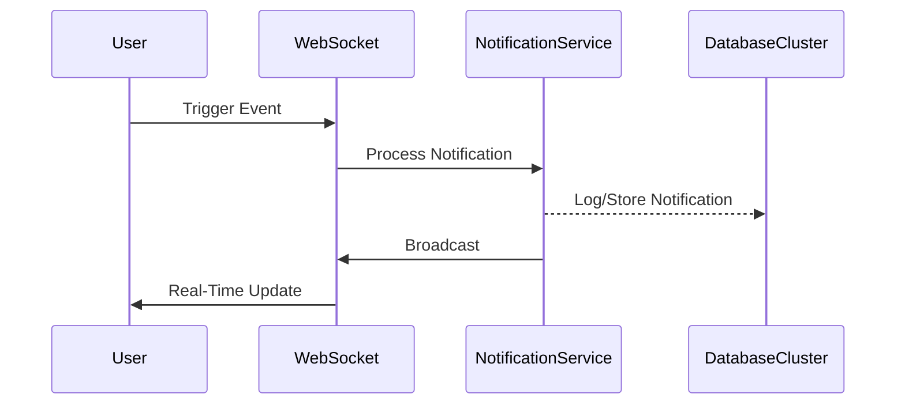

### Implementation Strategy
```javascript
class NotificationManager {
  constructor() {
    this.socketServer = io();
    this.subscribeToEvents();
  }

  subscribeToEvents() {
    this.socketServer.on('notification', this.handleNotification);
  }

  handleNotification(data) {
    // Dispatch to appropriate channels
    this.broadcastToClients(data);
    this.persistNotification(data);
  }
}
```

### 2. Distributed Session Management

**Overview**: Distributed sessions require centralized state management and secure token-based authentication.

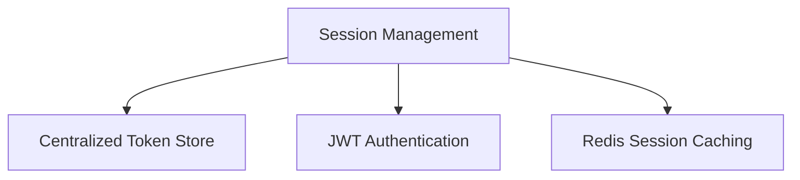

### Redis-Based Session Implementation
```javascript
const RedisStore = require('connect-redis')(session);
const redisClient = redis.createClient();

app.use(session({
  store: new RedisStore({ client: redisClient }),
  secret: 'complex-secret',
  resave: false
}));
```

### 3. Rate Limiting Across Services

**Overview**: Implement distributed rate limiting to prevent service abuse and ensure system stability.

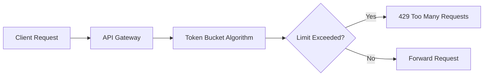

### Distributed Rate Limiter
```javascript
const rateLimit = require('express-rate-limit');

const apiLimiter = rateLimit({
  windowMs: 15 * 60 * 1000, // 15 minutes
  max: 100, // Limit each IP
  message: 'Too many requests'
});
```

### 4. API Idempotency Handling

**Overview**: Ensure consistent API behavior by tracking and preventing duplicate requests.

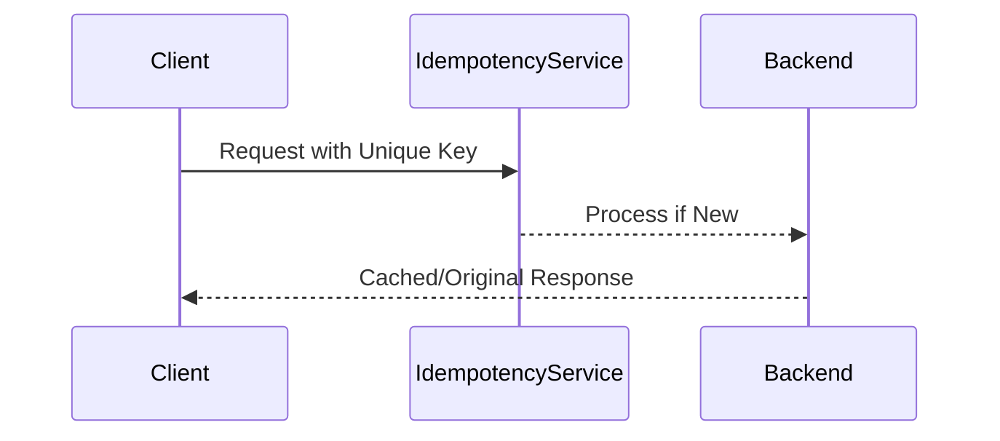

### Idempotency Key Implementation
```javascript
function handleRequest(req, res) {
  const idempotencyKey = req.headers['x-idempotency-key'];
  const cachedResponse = cache.get(idempotencyKey);

  if (cachedResponse) {
    return res.json(cachedResponse);
  }

  // Process request and cache response
}
```

### 5. API Versioning Strategies

**Overview**: Manage API evolution through structured versioning mechanisms.

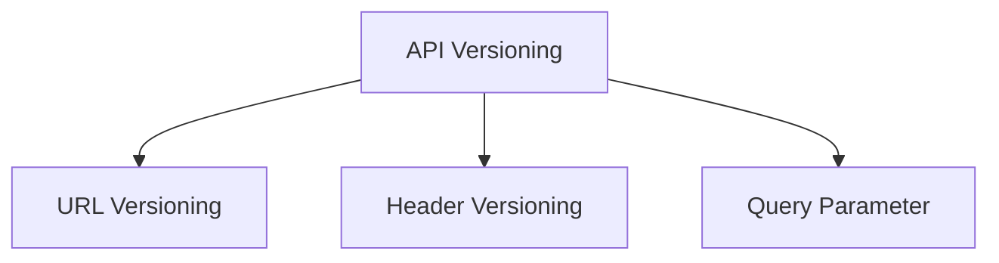

### Versioning Middleware
```javascript
function apiVersion(req, res, next) {
  const version = req.get('Accept-Version') || 'v1';
  req.apiVersion = version;
  next();
}
```

### 6. Autocomplete Search Feature

**Overview**: Implement efficient, low-latency search with intelligent indexing.

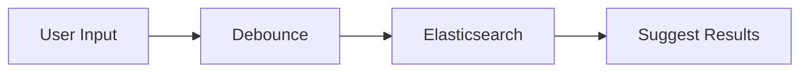

### Search Implementation
```javascript
async function searchAutocomplete(query) {
  return await ElasticsearchClient.search({
    index: 'products',
    body: {
      suggest: {
        productSuggester: {
          prefix: query,
          completion: { field: 'suggest' }
        }
      }
    }
  });
}
```

### 7. Distributed File Upload

**Overview**: Handle file uploads across multiple servers with consistent storage.

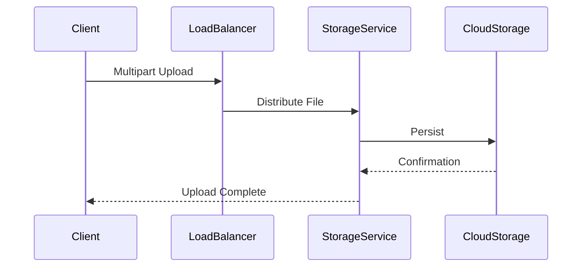

### Distributed Upload Handler
```javascript
const uploadMiddleware = multer({
  storage: multer.memoryStorage(),
  fileFilter: (req, file, cb) => {
    const allowedTypes = ['image/jpeg', 'image/png'];
    cb(null, allowedTypes.includes(file.mimetype));
  }
});
```

### 8. Microservices Cross-Cutting Concerns

**Overview**: Manage shared functionality across microservices.

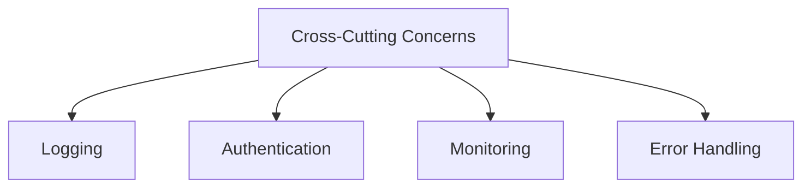

### Middleware Example
```javascript
function globalMiddleware(req, res, next) {
  logger.info(`${req.method} ${req.path}`);
  performAuth(req);
  errorTracker.monitor(req);
  next();
}
```

## Part 2: React Performance Optimization

### 1. React.memo() Usage

**Overview**: Prevent unnecessary re-renders for functional components.

```javascript
const MemoizedComponent = React.memo(
  (props) => <div>{props.value}</div>,
  (prevProps, nextProps) => prevProps.value === nextProps.value
);
```

### 2. React.lazy() Implementation

**Overview**: Code-splitting for performance optimization.

```javascript
const LazyComponent = React.lazy(() => 
  import('./HeavyComponent')
);

function App() {
  return (
    <Suspense fallback={<div>Loading...</div>}>
      <LazyComponent />
    </Suspense>
  );
}
```

### 3. Key Prop Performance

**Overview**: Efficient list rendering and reconciliation.

```javascript
function UserList({ users }) {
  return (
    <ul>
      {users.map(user => (
        <li key={user.id}>{user.name}</li>
      ))}
    </ul>
  );
}
```

### 4. Context Optimization

**Overview**: Prevent unnecessary context re-renders.

```javascript
const Context = React.createContext();

function ContextProvider({ children }) {
  const [state, dispatch] = useReducer(reducer, initialState);
  
  const memoizedValue = useMemo(() => ({
    state, 
    dispatch
  }), [state]);

  return (
    <Context.Provider value={memoizedValue}>
      {children}
    </Context.Provider>
  );
}
```

### 5. Bundle Size Reduction

**Overview**: Optimize webpack configuration and imports.

```javascript
// webpack.config.js
module.exports = {
  optimization: {
    splitChunks: {
      chunks: 'all'
    }
  }
};
```

### 6. Infinite Scrolling

**Overview**: Efficient data loading with intersection observer.

```javascript
function InfiniteScroll({ fetchMore }) {
  const observer = useRef();
  const lastElementRef = useCallback(node => {
    if (observer.current) observer.current.disconnect();
    observer.current = new IntersectionObserver(entries => {
      if (entries[0].isIntersecting) {
        fetchMore();
      }
    });
    if (node) observer.current.observe(node);
  }, []);
}
```

### 7. CSS-in-JS Performance

**Overview**: Optimize runtime performance and styling.

```javascript
const styled = createStyled({
  shouldForwardProp: (prop) => !['margin', 'padding'].includes(prop)
});

const Box = styled('div', {
  compilerConfig: {
    shouldUseSingleQuote: true
  }
});
```

### 8. Image Optimization

**Overview**: Efficient image loading and rendering.

```javascript
function OptimizedImage({ src, alt }) {
  return (
    
  );
}
```
---


# Advanced Technical Exploration

## Part 1: Advanced SQL Scenarios

### 1. Duplicate Record Detection with Window Functions

**Detailed Explanation**:
Duplicate record detection is crucial for data integrity and cleaning. Window functions provide a powerful mechanism to identify and analyze duplicate entries by comparing rows within a specified partition, allowing for sophisticated duplicate identification strategies.

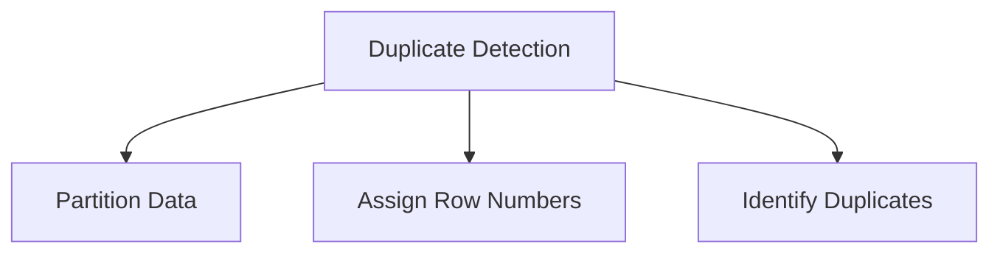

**Implementation Strategy**:
```sql
WITH DuplicateRecords AS (
  SELECT 
    *,
    ROW_NUMBER() OVER (
      PARTITION BY email, first_name, last_name 
      ORDER BY created_at
    ) AS duplicate_count
  FROM users
)
SELECT * FROM DuplicateRecords 
WHERE duplicate_count > 1;
```

### 2. Hierarchical Data with Recursive CTEs

**Detailed Explanation**:
Recursive Common Table Expressions (CTEs) enable elegant traversal and querying of hierarchical data structures like organizational charts, category trees, or complex relationship networks. They allow SQL to perform tree-like traversals efficiently.

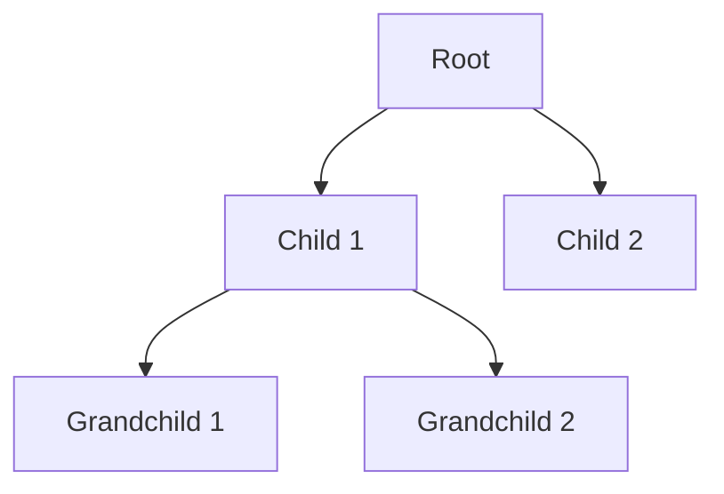

**Implementation Strategy**:
```sql
WITH RECURSIVE OrganizationHierarchy AS (
  -- Base case: Select root employees
  SELECT 
    employee_id, 
    name, 
    manager_id, 
    1 AS hierarchy_level
  FROM employees
  WHERE manager_id IS NULL

  UNION ALL

  -- Recursive case: Join with previous level
  SELECT 
    e.employee_id, 
    e.name, 
    e.manager_id, 
    oh.hierarchy_level + 1
  FROM employees e
  JOIN OrganizationHierarchy oh 
    ON e.manager_id = oh.employee_id
)
SELECT * FROM OrganizationHierarchy;
```

### 3. Running Totals and Moving Averages

**Detailed Explanation**:
Calculating running totals and moving averages is essential for time-series analysis, financial reporting, and trend identification. Window functions provide a clean, performant method to compute these rolling metrics.

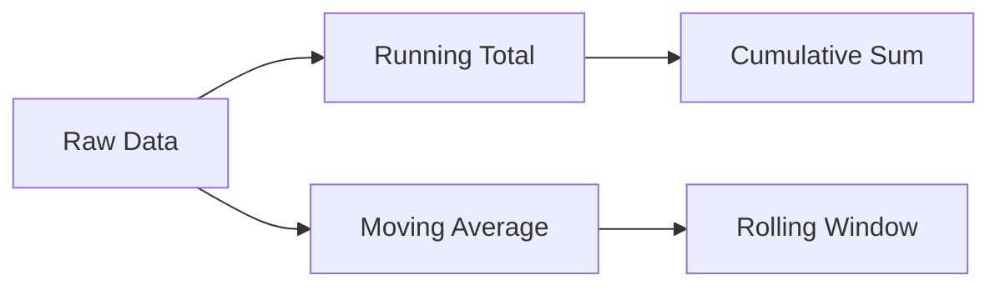

**Implementation Strategy**:
```sql
SELECT 
  date,
  amount,
  SUM(amount) OVER (ORDER BY date) AS running_total,
  AVG(amount) OVER (
    ORDER BY date 
    ROWS BETWEEN 3 PRECEDING AND CURRENT ROW
  ) AS moving_average
FROM sales;
```

### 4. Slowly Changing Dimensions

**Detailed Explanation**:
Slowly Changing Dimensions (SCD) manage historical data tracking, allowing systems to preserve historical context while reflecting current state. Type 1 and Type 2 approaches offer different strategies for handling dimensional changes.

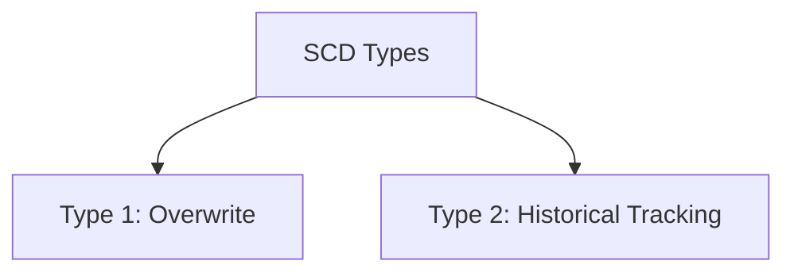

**Implementation Strategy**:
```sql
-- Type 1: Overwrite (Destructive Update)
UPDATE dimension_table
SET current_value = new_value
WHERE key = specific_key;

-- Type 2: Historical Tracking
INSERT INTO dimension_table (
  key, value, valid_from, valid_to, is_current
) VALUES (
  new_key, new_value, current_timestamp, 
  NULL, 1
);
```

### 5. Pagination with Consistent Ordering

**Detailed Explanation**:
Efficient pagination requires stable, predictable sorting to ensure consistent result sets across pages, preventing data skew and maintaining user experience.

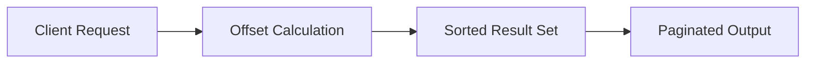

**Implementation Strategy**:
```sql
SELECT *
FROM products
ORDER BY product_id, name
OFFSET (@page_number - 1) * @page_size ROWS
FETCH NEXT @page_size ROWS ONLY;
```

### 6. Dynamic Pivoting

**Detailed Explanation**:
Dynamic pivoting transforms rows into columns, enabling flexible reporting and cross-tabulation without hardcoding column names.

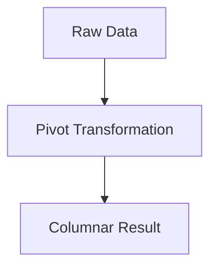

**Implementation Strategy**:
```sql
SELECT 
  category,
  MAX(CASE WHEN metric = 'sales' THEN value END) AS sales,
  MAX(CASE WHEN metric = 'profit' THEN value END) AS profit
FROM pivot_source
GROUP BY category;
```

### 7. Temporal Data Querying

**Detailed Explanation**:
Temporal data management involves tracking changes over time, supporting historical analysis and bitemporal modeling.

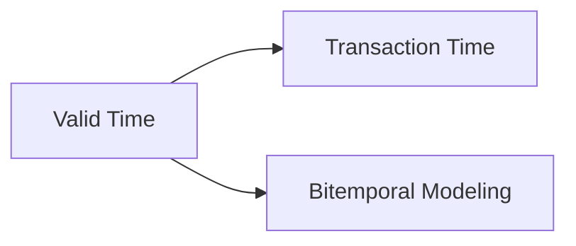

**Implementation Strategy**:
```sql
CREATE TABLE employee_history (
  employee_id INT,
  name VARCHAR(100),
  valid_from TIMESTAMP,
  valid_to TIMESTAMP,
  PERIOD FOR SYSTEM_TIME
);
```

### 8. Search with Relevance Ranking

**Detailed Explanation**:
Advanced search implements sophisticated ranking algorithms to provide more meaningful search results based on multiple relevance factors.

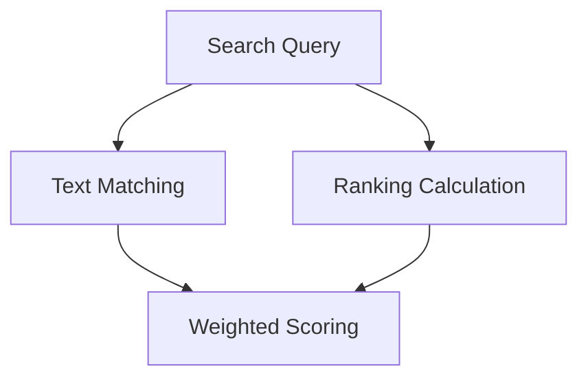

**Implementation Strategy**:
```sql
SELECT 
  product_name,
  ts_rank(
    to_tsvector('english', product_description),
    to_tsquery('search & terms')
  ) AS relevance_score
FROM products
ORDER BY relevance_score DESC;
```

## Part 2: Microservices Patterns

### 1. Circuit Breaker Pattern

**Detailed Explanation**:
The Circuit Breaker prevents cascading failures by temporarily interrupting service communication when repeated failures are detected, allowing systems to recover and maintain overall stability.

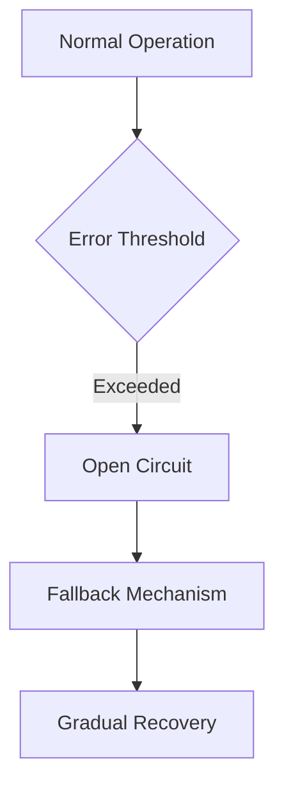

**Implementation Example**:
```javascript
class CircuitBreaker {
  constructor(failureThreshold = 3, resetTimeout = 30000) {
    this.state = 'CLOSED';
    this.failureCount = 0;
    this.lastFailureTime = null;
  }

  async execute(request) {
    if (this.state === 'OPEN') {
      if (Date.now() - this.lastFailureTime > this.resetTimeout) {
        this.state = 'HALF_OPEN';
      } else {
        throw new Error('Circuit is OPEN');
      }
    }

    try {
      const result = await request();
      this.reset();
      return result;
    } catch (error) {
      this.recordFailure();
      throw error;
    }
  }
}
```

### 2. Saga Pattern for Distributed Transactions

**Detailed Explanation**:
The Saga pattern manages complex distributed transactions by breaking them into smaller, local transactions with compensating actions to maintain data consistency across services.

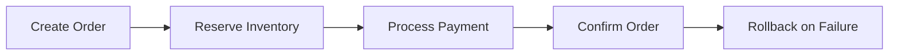

**Implementation Approach**:
```javascript
async function createOrderSaga(order) {
  try {
    await reserveInventory(order);
    await processPayment(order);
    await confirmOrder(order);
  } catch (error) {
    await compensateTransaction(order);
  }
}
```

### 3. API Gateway Pattern

**Detailed Explanation**:
An API Gateway serves as a single entry point for client requests, providing routing, authentication, and cross-cutting concerns management for microservices.

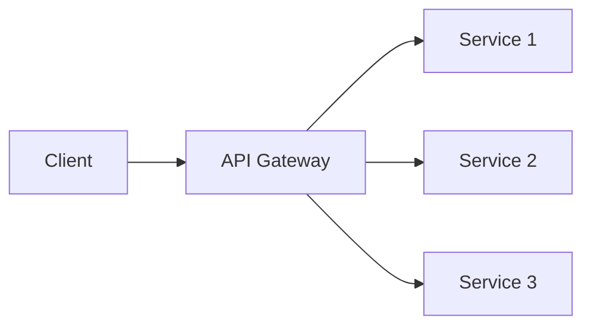

**Implementation Strategy**:
```javascript
const express = require('express');
const gateway = express();

gateway.use(authMiddleware);
gateway.use('/users', userServiceProxy);
gateway.use('/products', productServiceProxy);
```

### 4. Service Discovery Mechanism

**Detailed Explanation**:
Service discovery enables dynamic registration and resolution of service instances, supporting scalability and fault tolerance in distributed systems.

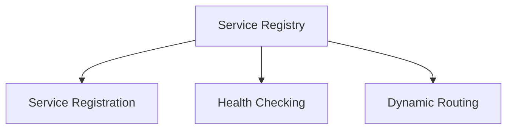

**Implementation Approach**:
```javascript
class ServiceRegistry {
  constructor() {
    this.services = new Map();
  }

  register(serviceName, instanceDetails) {
    if (!this.services.has(serviceName)) {
      this.services.set(serviceName, []);
    }
    this.services.get(serviceName).push(instanceDetails);
  }

  discoverService(serviceName) {
    return this.services.get(serviceName) || [];
  }
}
```
---


# Advanced TypeScript Features

## Conditional Types

**Concept**: Conditional types allow dynamic type generation based on type relationships.

```ascii
+-------------------+
| Condition Type   |
|  Input Type A    |
|  Input Type B    |
|        ↓         |
| Resulting Type   |
+-------------------+
```

**Implementation**:
```typescript
type IsString<T> = T extends string ? true : false;
type Result = IsString<"hello">; // true
```

## Mapped Types

**Concept**: Transform existing types by mapping over their properties.

```ascii
+-------------------+
| Original Type    |
|  prop1: string   |
|  prop2: number   |
|        ↓         |
| Transformed Type |
|  prop1: boolean  |
|  prop2: boolean  |
+-------------------+
```

**Implementation**:
```typescript
type Nullable<T> = { [P in keyof T]: T[P] | null };
```

## Infer Keyword

**Concept**: Dynamically extract and infer types within conditional types.

```ascii
+-------------------+
| Type Extraction  |
|  Function Type   |
|    Inference     |
|        ↓         |
| Extracted Return |
+-------------------+
```

**Implementation**:
```typescript
type ReturnTypeExtractor<T> = 
  T extends (...args: any[]) => infer R ? R : never;
```

## Generic Constraints

**Concept**: Limit generic types to specific structures or behaviors.

```ascii
+-------------------+
| Generic Type T   |
|    Constraints   |
|   Must Contain   |
|   Length/Name    |
+-------------------+
```

**Implementation**:
```typescript
interface Lengthwise { length: number; }
function getLength<T extends Lengthwise>(arg: T): number {
  return arg.length;
}
```

## Utility Types

**Concept**: Built-in type transformations for common type manipulations.

```ascii
+-------------------+
| Original Type    |
|  prop1: string   |
|  prop2: number   |
|        ↓         |
| Transformed Type |
|  prop1?: string  |
|  prop2?: number  |
+-------------------+
```

**Implementation**:
```typescript
type User = { name: string; age: number };
type PartialUser = Partial<User>;
type RequiredUser = Required<User>;
```

## Async Type Inference

**Concept**: Inferring types in asynchronous functions and promises.

```ascii
+-------------------+
| Async Function   |
|    Promise       |
|  Type Inference  |
|        ↓         |
| Resolved Type    |
+-------------------+
```

**Implementation**:
```typescript
async function fetchData(): Promise<string> {
  return "data";
}
```

## Decorators

**Concept**: Modify or enhance class, method, or property behavior.

```ascii
+-------------------+
| Class/Method     |
|    Decorator     |
|  Transformation  |
|        ↓         |
| Enhanced Behavior|
+-------------------+
```

**Implementation**:
```typescript
function log(target: any, key: string, descriptor: PropertyDescriptor) {
  const original = descriptor.value;
  descriptor.value = function(...args: any[]) {
    console.log(`Calling ${key}`);
    return original.apply(this, args);
  };
}
```

## Branded Types

**Concept**: Create type-safe primitive wrappers to prevent incorrect usage.

```ascii
+-------------------+
| Primitive Type   |
|   With Unique    |
|    Brand Tag     |
|        ↓         |
| Type-Safe Wrapper|
+-------------------+
```

**Implementation**:
```typescript
type Brand<K, T> = K & { __brand: T };
type UserId = Brand<number, 'UserId'>;
```

# System Design Concepts

## URL Shortener Service

**Architecture**:
```ascii
+-------------+     +-------------+     +-------------+
|   Client    | --> |  Web Server | --> |  Database   |
+-------------+     +-------------+     +-------------+
       ↑                                     |
       |                                     |
       +-------------------------------------+
```

**Key Components**:
- Unique ID generation
- URL mapping storage
- Redirection mechanism

## Chat Application

**Architecture**:
```ascii
+-------------+     +-------------+     +-------------+
|   Client A  | <-> |  WebSocket  | <-> |   Server    |
+-------------+     |   Service   |     +-------------+
+-------------+     +-------------+     |  Database   |
|   Client B  | <->                     +-------------+
+-------------+
```

**Key Features**:
- Real-time messaging
- User authentication
- Message persistence

## Social Media Feed

**Architecture**:
```ascii
+-------------+     +-------------+     +-------------+
|   Client    | --> |  Web Server | --> |  Database   |
+-------------+     +-------------+     +-------------+
                    |   Caching   |
                    +-------------+
```

**Design Principles**:
- Horizontal scaling
- Content aggregation
- Personalized feed generation

## File Sharing Service

**Architecture**:
```ascii
+-------------+     +-------------+     +-------------+
|   Client    | --> |  Upload SVC | --> |   Storage   |
+-------------+     +-------------+     +-------------+
       ↑                                     |
       |                                     |
       +-------------------------------------+
```

**Key Components**:
- File metadata tracking
- Access control
- Distributed storage

## E-Commerce Product Catalog

**Architecture**:
```ascii
+-------------+     +-------------+     +-------------+
|   Client    | --> |  Web Server | --> |  Database   |
+-------------+     +-------------+     +-------------+
                    |   Caching   |
                    +-------------+
```

**Design Considerations**:
- Product indexing
- Search functionality
- Dynamic pricing

## Caching System

**Architecture**:
```ascii
+-------------+     +-------------+     +-------------+
|   Client    | --> |   Cache SVC | --> |  Database   |
+-------------+     +-------------+     +-------------+
```

**Implementation Strategy**:
- LRU (Least Recently Used) eviction
- Time-based expiration
- Cache coherence

## Notification Service

**Architecture**:
```ascii
+-------------+     +-------------+     +-------------+
|   Event     | --> | Notification| --> |   Client    |
|   Source    |     |   Service   |     +-------------+
+-------------+     +-------------+
```

**Key Features**:
- Multi-channel delivery
- User preference management
- Rate limiting

## Authentication System

**Architecture**:
```ascii
+-------------+     +-------------+     +-------------+
|   Client    | --> | Auth Server | --> |  Database   |
+-------------+     +-------------+     +-------------+
```

**Security Considerations**:
- Password hashing
- Token-based authentication
- Multi-factor support

---


# Integration and Deployment Best Practices

## 1. Zero-Downtime Database Migrations

### In-Depth Explanation
Zero-downtime migrations require careful orchestration to maintain service availability while updating database schemas. This involves multiple stages and backward compatibility considerations.

```ascii
Phase 1: Preparation         Phase 2: Migration         Phase 3: Cleanup
+------------------+        +------------------+        +------------------+
|  Deploy New Code |   →    |  Migrate Data    |   →    |  Remove Old Code |
|  (Dual Schema)   |        |  (Background)    |        |  & Schema        |
+------------------+        +------------------+        +------------------+
```

### Implementation Strategy:

1. **Backward Compatible Changes**:
```sql
-- Instead of direct column removal
ALTER TABLE users 
ADD COLUMN email_new VARCHAR(255);

-- Copy data
UPDATE users 
SET email_new = email;

-- Later: Remove old column
ALTER TABLE users 
DROP COLUMN email;
```

2. **Database Version Control**:
```yaml
migrations/
  ├── V1__initial_schema.sql
  ├── V2__add_email_column.sql
  └── V3__cleanup_old_columns.sql
```

3. **Rollback Strategy**:
```sql
-- Always include rollback scripts
CREATE PROCEDURE RollbackMigration_V2()
BEGIN
  -- Restore previous state
  ALTER TABLE users 
  DROP COLUMN email_new;
END;
```

## 2. Gradual Feature Rollouts

### In-Depth Explanation
Feature rollouts should be controlled and monitored to minimize risk and enable quick rollback if issues arise.

```ascii
+------------------+     +------------------+     +------------------+
|   Feature Flags  | →   | Canary Release   | →   | Full Rollout     |
|   (Toggle)       |     | (% of Users)     |     | (All Users)      |
+------------------+     +------------------+     +------------------+
```

### Implementation Approaches:

1. **Feature Flag Configuration**:
```javascript
const featureFlags = {
  newUserInterface: {
    enabled: true,
    rolloutPercentage: 25,
    whitelist: ['beta-testers'],
    startDate: '2024-01-01'
  }
};
```

2. **Progressive Rollout Logic**:
```javascript
function shouldEnableFeature(userId, feature) {
  // Check whitelist
  if (feature.whitelist.includes(getUserGroup(userId))) return true;
  
  // Check rollout percentage
  return calculateUserPercentile(userId) <= feature.rolloutPercentage;
}
```

## 3. Environment-Specific Configuration

### In-Depth Explanation
Configuration management should support multiple environments while maintaining security and flexibility.

```ascii
Configuration Flow
+-------------+     +----------------+     +-------------+
|   Dev       |     |   Staging     |     |   Prod      |
| (.env.dev)  | →   | (.env.staging)| →   | (.env.prod) |
+-------------+     +----------------+     +-------------+
       ↓                    ↓                    ↓
   Local Vars         Vault Secrets        KMS Secrets
```

### Implementation Strategy:

1. **Environment Configuration**:
```javascript
// config.js
const config = {
  database: {
    host: process.env.DB_HOST,
    port: process.env.DB_PORT,
    credentials: loadSecrets('database')
  },
  features: loadFeatureFlags(process.env.ENVIRONMENT)
};
```

2. **Secret Management**:
```yaml
# docker-compose.yml
services:
  app:
    environment:
      - NODE_ENV=${NODE_ENV}
      - DB_HOST=${DB_HOST}
    secrets:
      - db_password
      - api_key
```

## 4. API Documentation

### In-Depth Explanation
API documentation should be automated, accurate, and easily maintainable.

```ascii
Documentation Flow
+-------------+     +----------------+     +-------------+
|   Code      |     |   Generator   |     |    Docs     |
| Annotations | →   |   (Swagger)   | →   |   Portal    |
+-------------+     +----------------+     +-------------+
```

### Implementation Example:

1. **OpenAPI Specification**:
```yaml
paths:
  /users:
    get:
      summary: Retrieve users
      parameters:
        - name: limit
          in: query
          schema:
            type: integer
      responses:
        '200':
          description: List of users
```

2. **Code Documentation**:
```javascript
/**
 * @api {get} /users Get Users
 * @apiName GetUsers
 * @apiGroup User
 * @apiParam {Number} limit Number of users to return
 */
async function getUsers(limit) {
  // Implementation
}
```

## 5. Monitoring and Alerting

### In-Depth Explanation
Comprehensive monitoring covers infrastructure, application performance, and business metrics.

```ascii
Monitoring Stack
+-------------+     +----------------+     +-------------+
|  Metrics    |     |  Aggregation  |     |  Alerting   |
| Collection  | →   |   & Analysis  | →   |  Rules      |
+-------------+     +----------------+     +-------------+
```

### Implementation Approach:

1. **Metric Collection**:
```javascript
const metrics = {
  requestDuration: new Histogram({
    name: 'http_request_duration_seconds',
    help: 'HTTP request duration in seconds',
    labelNames: ['method', 'route', 'status']
  })
};
```

2. **Alert Configuration**:
```yaml
alerts:
  - name: high_error_rate
    condition: error_rate > 5%
    duration: 5m
    severity: critical
    channels: ['slack', 'pagerduty']
```

## 6. Error Tracking and Debugging

### In-Depth Explanation
Effective error tracking combines logging, tracing, and context collection.

```ascii
Error Handling Flow
+-------------+     +----------------+     +-------------+
|   Error     |     |    Logging    |     |   Alert     |
| Detection   | →   |    & Tracing  | →   |   Team      |
+-------------+     +----------------+     +-------------+
```

### Implementation Strategy:

1. **Structured Logging**:
```javascript
const logger = {
  error: (err, context) => {
    console.error({
      timestamp: new Date(),
      error: err.message,
      stack: err.stack,
      context,
      severity: 'ERROR'
    });
  }
};
```

2. **Error Tracking Integration**:
```javascript
class ErrorTracker {
  captureError(error, context) {
    // Capture error details
    const errorReport = {
      message: error.message,
      stack: error.stack,
      userId: context.userId,
      sessionId: context.sessionId,
      environment: process.env.NODE_ENV
    };
    
    // Send to error tracking service
    this.sendToErrorService(errorReport);
  }
}
```

## 7. Local Development Dependencies

### In-Depth Explanation
Local development should mirror production while remaining lightweight and manageable.

```ascii
Local Dev Environment
+-------------+     +----------------+     +-------------+
|   Service   |     |    Docker     |     |   Mocked    |
|   Code      | →   |    Compose    | →   |   Services  |
+-------------+     +----------------+     +-------------+
```

### Implementation Example:

1. **Docker Compose Setup**:
```yaml
version: '3'
services:
  app:
    build: .
    volumes:
      - .:/app
    depends_on:
      - db
      - redis
  
  db:
    image: postgres:13
    environment:
      POSTGRES_DB: myapp_dev
```

2. **Service Mocking**:
```javascript
const mockServices = {
  payment: {
    process: async (amount) => ({
      success: true,
      transactionId: 'mock_tx_' + Date.now()
    })
  }
};
```

## 8. Testing Microservices

### In-Depth Explanation
Testing microservices requires a combination of unit, integration, and end-to-end tests.

```ascii
Testing Pyramid
      /\
     /E2E\
    /─────\
   /  Int  \
  /─────────\
 /   Unit    \
/─────────────\
```

### Implementation Strategy:

1. **Unit Testing**:
```javascript
describe('UserService', () => {
  it('should create user', async () => {
    const service = new UserService(mockDb);
    const user = await service.createUser({
      name: 'Test User',
      email: 'test@example.com'
    });
    expect(user).toBeDefined();
  });
});
```

2. **Integration Testing**:
```javascript
describe('UserAPI', () => {
  beforeAll(async () => {
    await startTestServices();
  });

  it('should handle user creation flow', async () => {
    const response = await request(app)
      .post('/api/users')
      .send({
        name: 'Test User',
        email: 'test@example.com'
      });
    
    expect(response.status).toBe(201);
  });
});
```
