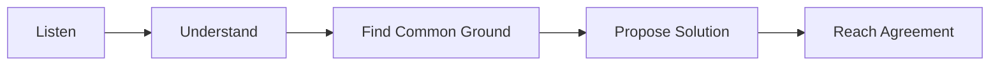
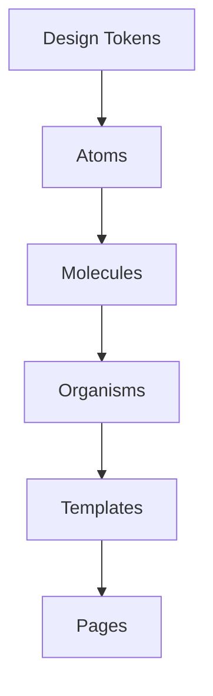

### **1. Design a Distributed Job Scheduling System**

**Solution**: Jobs are submitted by clients to a **Scheduler**, which enqueues them in a **Message Queue** (e.g., RabbitMQ). **Workers** pull tasks from the queue and process them. The **Database** tracks job statuses (e.g., pending, running, completed). Failed jobs are re-enqueued for retries by the scheduler, while a monitoring dashboard provides real-time status updates.

**Diagram**:
```
Client ---> Scheduler ---> Message Queue ---> Worker Pool ---> Database
                     ^                              |
                 Monitoring <-----------------------
```

---

### **2. How Would You Design Instagram's Story Feature?**

**Solution**: Users upload stories, which are stored in an **Object Storage** system like S3. Metadata (e.g., user ID, timestamps, and TTL) is saved in a **Database**. Stories are cached in **Redis** for fast access and delivered through a **CDN** for low-latency viewing. Expiration is managed using TTL at the storage and cache layers.

**Diagram**:
```
Uploader ---> Object Storage ---> Metadata DB
                |                     ^
Viewer ---> Cache (Redis) <------- Expired TTL
                |
           Content Delivery Network (CDN)
```

---

### **3. Design a Real-Time Analytics Dashboard System**

**Solution**: Data from different sources is streamed into a **Message Broker** (e.g., Kafka). A **Stream Processor** (e.g., Apache Flink) aggregates and processes the data, storing results in a **Time-Series Database** (e.g., InfluxDB). The dashboard fetches data via **WebSockets** for live updates.

**Diagram**:
```
Data Sources ---> Message Broker ---> Stream Processor ---> Time-Series DB
                                                          |
                                                   Real-Time Dashboard
```

---

### **4. How Would You Design a Collaborative Document Editing System?**

**Solution**: Users edit a document through a **WebSocket-based server** for real-time communication. A **CRDT (Conflict-free Replicated Data Type)** or OT (Operational Transformation) ensures consistency across edits. Changes are saved to a **Database** and versioned for rollback and audit.

**Diagram**:
```
Clients ---> WebSocket Server ---> CRDT/OT Engine ---> Versioned Database
```

---

### **5. Design a Ride-Sharing Service's Matching System**

**Solution**: Drivers periodically update their locations, stored in a **Geospatial Database** (e.g., Redis with geospatial indices). When a user requests a ride, the **Matching Engine** queries nearby drivers and matches them based on proximity and availability. Notifications are sent to both the driver and user.

**Diagram**:
```
Driver ---> Geospatial DB (Redis) ---> Matching Engine ---> Notifications
    ^                                                          |
  Rider -------------------------------------------------------
```

---

### **6. How Would You Architect a Content Delivery Network (CDN)?**

**Solution**: A user's request is routed via **GeoDNS** to the nearest **Edge Server**, which caches content for low latency. If the content is unavailable, it fetches it from the **Origin Server** and stores it locally for future requests.

**Diagram**:
```
User ---> GeoDNS ---> Edge Server ---> Origin Server
                  [Nearest Server]
```

---

### **7. Design a Rate Limiting System for a Distributed Environment**

**Solution**: API requests are checked against a **Token Bucket** implemented in **Redis**. Each user gets a bucket with tokens replenished over time. If the bucket is empty, further requests are blocked. Distributed locks ensure atomic updates to token counts.

**Diagram**:
```
Client ---> API Gateway ---> Rate Limiter (Redis) ---> Backend Service
```

**Code Example**:
```javascript
function rateLimiter(userId) {
  const tokens = redis.get(userId);
  if (tokens > 0) {
    redis.decrement(userId);
    return true; // Proceed
  } else {
    return false; // Block request
  }
}
```

---

### **8. Explain How You Would Design Twitter's Trending Topics Feature**

**Solution**: Tweets are streamed into **Kafka** and processed in real time by a **Stream Processing System** (e.g., Apache Spark). Hashtag frequencies are calculated, and top trends are stored in **Redis** for fast retrieval. A REST **API** serves the trending topics to clients.

**Diagram**:
```
Tweets ---> Kafka ---> Stream Processor ---> Redis ---> REST API
```


---


### **1. How would you implement infinite scroll with virtualization?**

To implement infinite scroll with virtualization, use a library like **react-window** to render only the visible items. Fetch more data when the user scrolls near the end of the list.

```typescript
import { FixedSizeList as List } from 'react-window';

const Item = ({ index, style }) => (
  <div style={style}>Item {index}</div>
);

const InfiniteScroll = () => (
  <List
    height={500}
    itemCount={1000} // Total items
    itemSize={35}
    width={300}
  >
    {Item}
  </List>
);
```

---

### **2. Explain strategies for optimizing API response times**

**Solution**: Cache responses, minimize data transfer by filtering unnecessary fields, use pagination, and optimize database queries. Utilize **CDNs** for static assets and **load balancers** for high availability.

**Diagram**:
```
Client ---> CDN ---> Load Balancer ---> API ---> Optimized DB
```

---

### **3. How do you implement effective client-side caching?**

**Solution**: Use HTTP caching headers like **ETag** and **Cache-Control**. Store frequently used data in **localStorage**, **sessionStorage**, or **IndexedDB** for offline-first behavior. Integrate caching libraries like **React Query** for API calls.

```typescript
const fetchData = async () => {
  const data = localStorage.getItem('key');
  if (data) return JSON.parse(data);

  const response = await fetch('/api');
  const result = await response.json();
  localStorage.setItem('key', JSON.stringify(result));
  return result;
};
```

---

### **4. What techniques would you use for lazy loading images?**

**Solution**: Use the **Intersection Observer API** to detect when images enter the viewport and load them dynamically. You can also use libraries like **react-lazyload**.

```html

```

```javascript
const observer = new IntersectionObserver((entries) => {
  entries.forEach((entry) => {
    if (entry.isIntersecting) {
      const img = entry.target;
      img.src = img.dataset.src;
      observer.unobserve(img);
    }
  });
});
document.querySelectorAll('.lazy').forEach((img) => observer.observe(img));
```

---

### **5. Describe strategies for reducing time to first byte (TTFB)**

**Solution**: Use CDNs, enable server-side compression (e.g., gzip), minimize server-side processing, and deploy content closer to users through edge computing.

**Diagram**:
```
Client ---> CDN ---> Optimized Backend ---> Database
```

---

### **6. How do you optimize database query performance in a MERN stack?**

**Solution**: Index frequently queried fields, avoid N+1 queries by joining data efficiently, and use caching layers like **Redis** for repeated queries.

```javascript
// MongoDB Index Example
db.collection.createIndex({ field: 1 });
```

---

### **7. Explain techniques for reducing JavaScript bundle size**

**Solution**: Use tree-shaking to remove unused code, split bundles with **Webpack** or **Vite**, and lazy-load components. Minify the output with tools like **Terser**.

```javascript
const LazyComponent = React.lazy(() => import('./Component'));
```

---

### **8. What strategies would you use for optimizing WebSocket connections?**

**Solution**: Reuse WebSocket connections for multiple events, implement **heartbeats** to detect disconnections, and compress data payloads.

```javascript
const ws = new WebSocket('ws://server');
ws.onopen = () => ws.send(JSON.stringify({ type: 'ping' }));
```

**Diagram**:
```
Client ---> WebSocket Server ---> Backend Service
```


### **1. How do you implement database partitioning for large datasets?**

**Solution**: Partitioning splits a large table into smaller, more manageable pieces based on criteria like range, hash, or list. Each partition is stored separately to improve query performance.

```sql
-- Range Partition Example
CREATE TABLE orders (
  id SERIAL PRIMARY KEY,
  order_date DATE NOT NULL,
  amount DECIMAL
) PARTITION BY RANGE (order_date);

CREATE TABLE orders_2023 PARTITION OF orders FOR VALUES FROM ('2023-01-01') TO ('2024-01-01');
```

**How it works**: Queries targeting specific ranges only scan the relevant partitions, reducing I/O and speeding up response times.

---

### **2. Explain query optimization techniques for complex joins**

**Solution**:
- Use proper indexing on join columns.
- Prefer INNER JOINs over OUTER JOINs when applicable.
- Break down complex queries into smaller, simpler ones for analysis.

```sql
-- Indexing Join Columns
CREATE INDEX idx_users ON users(user_id);
CREATE INDEX idx_orders ON orders(user_id);

-- Optimized Join Query
SELECT u.name, o.amount
FROM users u
JOIN orders o ON u.user_id = o.user_id;
```

**How it works**: Indexing join columns minimizes the scan size and speeds up the lookup process during joins.

---

### **3. How would you implement efficient full-text search?**

**Solution**: Use **text indexes** in databases like PostgreSQL or external search engines like Elasticsearch for advanced capabilities.

```sql
-- PostgreSQL Full-Text Search
CREATE INDEX idx_text_search ON articles USING gin(to_tsvector('english', content));

-- Query Example
SELECT title 
FROM articles 
WHERE to_tsvector('english', content) @@ to_tsquery('search_term');
```

**How it works**: Text indexes tokenize and rank documents, enabling faster and more relevant search results.

---

### **4. Describe strategies for optimizing bulk operations**

**Solution**: Use **batch inserts/updates**, disable unnecessary triggers/indexes during operations, and use prepared statements for large datasets.

```sql
-- Batch Insert
INSERT INTO users (name, email) VALUES 
('User1', 'user1@example.com'), 
('User2', 'user2@example.com');
```

**How it works**: Bulk operations reduce overhead by grouping multiple commands into a single database transaction.

---

### **5. How do you handle database connection pooling effectively?**

**Solution**: Use connection pooling libraries like **pg-pool** (PostgreSQL) to manage and reuse connections efficiently.

```javascript
const { Pool } = require('pg');
const pool = new Pool({ max: 20, idleTimeoutMillis: 30000 });
const client = await pool.connect();
await client.query('SELECT * FROM users');
client.release();
```

**How it works**: Pooled connections reduce the overhead of opening and closing connections repeatedly, improving performance.

---

### **6. Explain techniques for query plan optimization**

**Solution**:
- Analyze query execution plans with tools like `EXPLAIN`.
- Avoid sequential scans by creating indexes.
- Rewrite subqueries as joins where applicable.

```sql
EXPLAIN ANALYZE
SELECT * FROM orders WHERE order_date > '2023-01-01';
```

**How it works**: Execution plans show how queries are executed, highlighting bottlenecks to optimize.

---

### **7. How would you implement efficient pagination for large datasets?**

**Solution**: Use **keyset pagination** instead of offset-based pagination to improve performance for large tables.

```sql
-- Keyset Pagination
SELECT id, name 
FROM users 
WHERE id > 1000 
ORDER BY id ASC 
LIMIT 10;
```

**How it works**: Keyset pagination uses a reference point (e.g., ID) instead of counting rows, avoiding performance degradation.

---

### **8. Describe strategies for caching database queries**

**Solution**: Use a caching layer like **Redis** to store frequent query results and reduce database load.

```javascript
const redis = require('redis');
const cacheKey = 'user:100';
const user = await redis.get(cacheKey);
if (!user) {
  const dbUser = await db.query('SELECT * FROM users WHERE id = 100');
  await redis.set(cacheKey, JSON.stringify(dbUser), 'EX', 3600); // Cache for 1 hour
}
```

**How it works**: Cached queries serve repeated requests directly from memory, significantly reducing database query time.


---


### **1. How would you implement OAuth 2.0 authorization flows?**

**Solution**: Use the **Authorization Code Flow** for secure communication between the client and the server. The client redirects the user to the authorization server, which issues an authorization code after successful authentication.

```plaintext
Client --> [Authorization Request] --> Authorization Server
Authorization Server --> [Auth Code] --> Client
Client --> [Token Request] --> Authorization Server
Authorization Server --> [Access Token] --> Client
```

**How it works**: The client exchanges the authorization code for an access token, which is used to access protected resources. This avoids exposing sensitive credentials like the user’s password.

---

### **2. Explain strategies for preventing XSS attacks**

**Solution**: 
- Sanitize user inputs.
- Use proper Content Security Policies (CSP).
- Escape output in HTML.

```javascript
// Example using DOMPurify
import DOMPurify from 'dompurify';
const safeHTML = DOMPurify.sanitize(untrustedHTML);
```

**How it works**: Sanitization removes malicious scripts from user input, while CSP restricts the sources from which scripts can be executed.

---

### **3. How do you implement secure file upload handling?**

**Solution**:
- Validate file types and sizes.
- Store files outside the web root directory.
- Use libraries like `multer` in Node.js for controlled file uploads.

```javascript
import multer from 'multer';
const upload = multer({ dest: 'uploads/' });
app.post('/upload', upload.single('file'), (req, res) => res.send('File uploaded!'));
```

**How it works**: Validation and secure storage prevent malicious file execution or server overload.

---

### **4. Describe approaches for API security using JWT**

**Solution**: Use **JWTs** for stateless authentication. Secure them with short expiration times, proper signature algorithms, and HTTPS-only transport.

```javascript
const jwt = require('jsonwebtoken');
const token = jwt.sign({ userId: 123 }, 'secretKey', { expiresIn: '1h' });
```

**How it works**: Clients send the JWT in the `Authorization` header. The server validates the token’s signature and claims without requiring session storage.

---

### **5. How would you implement role-based access control (RBAC)?**

**Solution**: Assign roles to users and define access policies per role. Validate roles on each request.

```javascript
const roles = { admin: ['read', 'write'], user: ['read'] };
function authorize(role, action) {
  return roles[role]?.includes(action);
}
```

**How it works**: The system verifies if a user’s role grants permission for a specific action before processing the request.

---

### **6. Explain strategies for preventing CSRF attacks**

**Solution**: Use CSRF tokens, validate origins, and set cookies with the `SameSite` attribute.

```javascript
// CSRF Token Example
const csrfToken = generateToken();
res.cookie('csrfToken', csrfToken, { httpOnly: true });
```

**How it works**: The server validates the token with each request, ensuring it originated from the trusted source.

---

### **7. How do you handle secure password storage and reset flows?**

**Solution**:
- Hash passwords using a strong hashing algorithm like bcrypt.
- Generate temporary, unique tokens for password resets.

```javascript
// Hashing Password
const bcrypt = require('bcrypt');
const hashedPassword = await bcrypt.hash('userPassword', 10);
```

**How it works**: The hashed password is stored in the database. Reset tokens are sent via secure channels and validated during reset requests.

---

### **8. Describe security considerations for WebSocket connections**

**Solution**:
- Use secure WebSocket (wss://).
- Authenticate connections with tokens.
- Limit incoming message sizes to prevent DoS attacks.

```javascript
// Secure WebSocket Connection Example
const ws = new WebSocket('wss://secure-server.com');
ws.on('open', () => ws.send(JSON.stringify({ token: 'authToken' })));
```

**How it works**: Secure WebSocket ensures encrypted communication, and token authentication validates users. Limiting message sizes protects against resource exhaustion attacks.

---

**Diagram for WebSocket Security**:
```plaintext
Client --> [Token Authentication] --> Server
        --> [Encrypted Data Transfer (wss)] --> 
```

This ensures authenticated, encrypted, and secure communication.

----


### **1. How would you handle complex form state with validation?**

**Solution**: Use a state management library like **Formik** or **React Hook Form**, combined with schema validation tools like **Yup**.

```javascript
import { useForm } from 'react-hook-form';
import * as yup from 'yup';

const schema = yup.object({
  email: yup.string().email().required(),
  password: yup.string().min(6).required(),
});

const Form = () => {
  const { register, handleSubmit, errors } = useForm({ validationSchema: schema });
  return (
    <form onSubmit={handleSubmit(data => console.log(data))}>
      <input {...register('email')} />
      {errors.email && <span>Email is invalid</span>}
      <input {...register('password')} />
      {errors.password && <span>Password must be 6+ characters</span>}
      <button type="submit">Submit</button>
    </form>
  );
};
```

**How it works**: The library manages state, validation, and errors while minimizing re-renders, and validation schemas handle complex rules.

---

### **2. Explain strategies for managing shared state in microservices**

**Solution**: Use a **message broker** like Kafka or RabbitMQ to sync state across services. A central database or distributed cache like Redis can also be used for shared state.

```plaintext
Service A <--> [Message Broker] <--> Service B
```

**How it works**: Services publish changes to the broker, and subscribers react to updates, ensuring decoupled and consistent state.

---

### **3. How do you handle optimistic updates in React applications?**

**Solution**: Update the local state immediately, then sync with the backend. Revert the change if the backend call fails.

```javascript
const [items, setItems] = useState([]);

const addItem = async (newItem) => {
  const optimisticItems = [...items, newItem];
  setItems(optimisticItems);
  try {
    await api.addItem(newItem);
  } catch {
    setItems(items); // Revert if the API call fails
  }
};
```

**How it works**: This approach improves perceived performance by showing changes immediately while maintaining consistency.

---

### **4. Describe approaches for managing WebSocket state**

**Solution**: Use a state management library like Redux or Zustand to manage WebSocket messages. Maintain a connection status and message history.

```plaintext
WebSocket --> [Connection Manager] --> State Store
           --> [Message Processor] -->
```

**How it works**: Centralized state ensures that WebSocket messages are processed and stored consistently, enabling real-time UI updates.

---

### **5. How would you implement undo/redo functionality?**

**Solution**: Use a **command pattern** with a history stack to track actions. Implement `undo` and `redo` by reversing or reapplying actions.

```javascript
const history = [];
const redoStack = [];

const addAction = (action) => {
  history.push(action);
  redoStack.length = 0; // Clear redo stack
};

const undo = () => {
  const action = history.pop();
  if (action) redoStack.push(action);
};

const redo = () => {
  const action = redoStack.pop();
  if (action) history.push(action);
};
```

**How it works**: Each action is stored in history, and reversing it restores the previous state.

---

### **6. Explain strategies for handling concurrent updates**

**Solution**: Use **optimistic concurrency control (OCC)** with versioning or timestamps. Update only if the version matches the latest.

```plaintext
Update Request --> [Check Version] --> Database
                 --> [Accept/Reject] -->
```

**How it works**: If two users try to modify the same resource, OCC ensures only the latest version is updated, preventing data loss.

---

### **7. How do you manage state in a complex wizard/multi-step form?**

**Solution**: Use a **state machine** or React Context to track progress and state.

```javascript
const [step, setStep] = useState(1);
const [formData, setFormData] = useState({});

const nextStep = (data) => {
  setFormData((prev) => ({ ...prev, ...data }));
  setStep((prev) => prev + 1);
};
```

**How it works**: State is centralized and updated progressively, ensuring data consistency across steps.

---

### **8. Describe patterns for handling offline state synchronization**

**Solution**: Use a **local database** like IndexedDB or SQLite to store changes offline. Sync changes to the server when the connection is restored.

```javascript
const syncData = async (localData) => {
  if (navigator.onLine) {
    await api.sync(localData);
    clearLocalData();
  }
};
```

**How it works**: Changes are queued locally and sent to the server when the connection is available, ensuring a seamless offline experience. 

**Diagram**:
```plaintext
[Client State] --> Local DB --> Sync Service --> Server
Offline Mode  --> Changes Stored Locally
```


---


I'll help you answer these behavioral questions with clear, structured responses that include relevant examples and explanations.

1. Challenging Technical Problem:
Here's how to structure this response effectively:

```txt
Problem → Analysis → Solution → Result
```

"Recently, I encountered a performance issue in our application where database queries were taking too long. After profiling the code, I discovered N+1 query problems in our ORM implementation. I implemented eager loading and query optimization, reducing response time by 70%. The key learning was the importance of monitoring query performance from the start."

2. Learning New Technologies:
I use a systematic learning approach:

```ascii
[Research] → [Hands-on Practice] → [Build Project] → [Share Knowledge]
     │              │                     │                │
     └─ Documentation  └─ Small exercises   └─ Real application └─ Team presentations
```

"I follow a four-step process: First, I research the technology's core concepts. Then, I practice with small exercises. Next, I build a practical project. Finally, I solidify my knowledge by teaching others."

3. Difficult Technical Decision:
Structure your response using:

```txt
Context → Options → Analysis → Decision → Outcome
```

"When choosing between microservices and monolithic architecture, I evaluated factors like team size, scalability needs, and maintenance overhead. I chose microservices because it better suited our long-term scaling needs, though it required more initial setup."

4. Handling Disagreements:
Use this communication flow:



"I focus on understanding the other person's perspective first. For example, when disagreeing about testing approaches, I listened to my colleague's concerns about test coverage, shared my thoughts on maintenance costs, and we found a balanced solution."

5. Code Review Approach:

"I follow a structured review process:
- First, understand the big picture
- Check for functionality and edge cases
- Review code style and best practices
- Provide constructive feedback with examples
- Follow up on implementation changes"

6. Task Prioritization:
Use this priority matrix:

```ascii
Urgent │ Important    │ Not Important
────────┼─────────────┼──────────────
High    │ Do First    │ Schedule
Low     │ Delegate    │ Optional
```

"I use the Eisenhower matrix to categorize tasks based on urgency and importance. I communicate with stakeholders about deadlines, assess dependencies, and maintain a flexible schedule to handle unexpected critical tasks."

These answers demonstrate:
- Clear problem-solving approach
- Focus on communication
- Data-driven decision making
- Collaborative mindset
- Systematic thinking

Remember to adapt these answers with your personal experiences while maintaining this structured approach.


---


### **1. How would you implement distributed tracing?**

**Solution**: Use a tracing library like OpenTelemetry to propagate a unique trace ID across services. Each service logs the trace ID with details of its execution.

```plaintext
[Client] --> Service A (Trace ID: 123) --> Service B (Trace ID: 123) --> DB
            [Trace Logs Stored in Tracing Backend (e.g., Jaeger)]
```

**How it works**: The trace ID allows tracking requests end-to-end, identifying bottlenecks or failures in a distributed system.

---

### **2. Explain strategies for implementing feature flags**

**Solution**: Use a feature flag management tool like LaunchDarkly or a custom configuration service to toggle features dynamically.

```javascript
const features = { newUI: true };

if (features.newUI) {
  renderNewUI();
} else {
  renderOldUI();
}
```

**How it works**: Feature flags allow enabling or disabling functionality without redeploying code, enabling gradual rollouts and A/B testing.

---

### **3. How do you handle service degradation gracefully?**

**Solution**: Implement **circuit breakers** and **fallback mechanisms**. Use libraries like Netflix Hystrix for server-side handling.

```plaintext
Request --> [Circuit Breaker] --> Service
           --> [Fallback Response]
```

**How it works**: Circuit breakers detect failures and stop requests to problematic services, providing default responses to maintain user experience.

---

### **4. Describe approaches for implementing A/B testing**

**Solution**: Assign users randomly to experiment groups and log their interactions for analysis. Tools like Google Optimize or custom scripts can manage A/B tests.

```plaintext
User --> [Experiment Allocator] --> [Version A | Version B]
```

**How it works**: Split traffic between different versions of a feature, measure user engagement, and decide the better-performing version.

---

### **5. How would you implement application monitoring?**

**Solution**: Use tools like Prometheus and Grafana for metric collection and visualization. Integrate error tracking with Sentry.

```plaintext
Application --> [Metrics Exporter] --> Prometheus --> Grafana
               --> [Error Tracker] --> Sentry
```

**How it works**: Metrics and errors are monitored in real-time, providing alerts and dashboards for application health and performance.

---

### **6. Explain strategies for handling backend failures in the frontend**

**Solution**: Show friendly error messages, retry failed requests, and use fallback content or cached data.

```javascript
fetchData().catch(() => {
  setErrorMessage('Unable to load data. Please try again later.');
});
```

**How it works**: The frontend detects failures and mitigates their impact on the user experience with clear communication and alternative options.

---

### **7. How do you implement logging in a distributed system?**

**Solution**: Use centralized logging tools like ELK Stack (Elasticsearch, Logstash, Kibana) or Fluentd to aggregate logs across services.

```plaintext
Service Logs --> Log Aggregator --> Centralized Store --> Kibana
```

**How it works**: Logs from all services are collected in a central repository, enabling search and correlation for debugging and analysis.

---

### **8. Describe approaches for implementing health checks**

**Solution**: Use **HTTP health check endpoints** in services. Include readiness (`/ready`) and liveness (`/live`) checks.

```javascript
app.get('/health', (req, res) => res.send('OK'));
```

**How it works**: Readiness checks ensure the service is ready to serve traffic, while liveness checks verify the service is running. Health checks help in load balancer and orchestration decisions.

**Diagram**:
```plaintext
[Load Balancer] --> /health
     Healthy Service: Route Traffic
     Unhealthy Service: Remove from Pool
```


---


I'll explain these frontend architecture concepts with clear examples and practical implementations.

1. Micro-frontends Implementation:
The main goal is to break down a large frontend application into smaller, manageable pieces.

```ascii
Main App (Container)
    │
    ├── MFE-1 (Team A) ─── Own Build/Deploy
    ├── MFE-2 (Team B) ─── Own Build/Deploy
    └── MFE-3 (Team C) ─── Own Build/Deploy
```

```typescript
// Container App
const App = () => {
  return (
    <div>
      <MicroFrontend name="header" host={HEADER_HOST} />
      <MicroFrontend name="products" host={PRODUCTS_HOST} />
      <MicroFrontend name="cart" host={CART_HOST} />
    </div>
  );
};
```

2. Design System Management:
A well-structured design system follows this hierarchy:



Key implementation:
```typescript
// Design tokens
export const tokens = {
  colors: {
    primary: '#007AFF',
    secondary: '#5856D6',
  },
  spacing: {
    sm: '8px',
    md: '16px',
  }
}

// Component using tokens
const Button = styled.button`
  background: ${tokens.colors.primary};
  padding: ${tokens.spacing.md};
`;
```

3. Complex Routing:
Here's how to handle nested and dynamic routing:

```ascii
/app
  ├── /dashboard
  │     ├── /:companyId
  │     └── /:companyId/projects/:projectId
  └── /settings
        ├── /profile
        └── /billing
```

```typescript
const Routes = () => (
  <Router>
    <Route path="/app" element={<AppLayout />}>
      <Route path="dashboard">
        <Route path=":companyId" element={<Company />}>
          <Route path="projects/:projectId" element={<Project />} />
        </Route>
      </Route>
    </Route>
  </Router>
);
```

4. Client-side Search:
For efficient client-side search:

```typescript
// Using a search index for better performance
const searchIndex = new FlexSearch({
  encode: "advanced",
  tokenize: "forward",
  suggest: true,
});

const searchItems = (query) => {
  const results = searchIndex.search(query);
  return debounce(results, 300);
};
```

5. Drag-and-Drop Interface:
Using React DnD or react-beautiful-dnd:


```tsx
import { useState } from 'react';
import { DragDropContext, Droppable, Draggable } from 'react-beautiful-dnd';

const DraggableList = () => {
  const [items, setItems] = useState(['Item 1', 'Item 2', 'Item 3']);

  const handleDragEnd = (result) => {
    if (!result.destination) return;
    
    const newItems = Array.from(items);
    const [reorderedItem] = newItems.splice(result.source.index, 1);
    newItems.splice(result.destination.index, 0, reorderedItem);
    
    setItems(newItems);
  };

  return (
    <DragDropContext onDragEnd={handleDragEnd}>
      <Droppable droppableId="list">
        {(provided) => (
          <div 
            {...provided.droppableProps} 
            ref={provided.innerRef}
            className="space-y-2 p-4"
          >
            {items.map((item, index) => (
              <Draggable key={item} draggableId={item} index={index}>
                {(provided) => (
                  <div
                    ref={provided.innerRef}
                    {...provided.draggableProps}
                    {...provided.dragHandleProps}
                    className="p-4 bg-white shadow rounded"
                  >
                    {item}
                  </div>
                )}
              </Draggable>
            ))}
            {provided.placeholder}
          </div>
        )}
      </Droppable>
    </DragDropContext>
  );
};

export default DraggableList;

```

6. Form State Persistence:
Using a combination of local storage and form state management:

```typescript
const usePersistedForm = (formKey) => {
  const [values, setValues] = useState(() => {
    const saved = localStorage.getItem(formKey);
    return saved ? JSON.parse(saved) : initialValues;
  });

  useEffect(() => {
    localStorage.setItem(formKey, JSON.stringify(values));
  }, [values, formKey]);

  return [values, setValues];
};
```

7. Error Boundaries:
Implementation pattern:

```typescript
class ErrorBoundary extends React.Component {
  state = { hasError: false, error: null };
  
  static getDerivedStateFromError(error) {
    return { hasError: true, error };
  }
  
  componentDidCatch(error, info) {
    logErrorToService(error, info);
  }

  render() {
    if (this.state.hasError) {
      return <ErrorFallback error={this.state.error} />;
    }
    return this.props.children;
  }
}
```

8. Complex Animations:
Using a combination of CSS transitions and React Spring:

```typescript
const AnimatedComponent = () => {
  const transitions = useTransition(items, {
    from: { opacity: 0, transform: 'scale(0)' },
    enter: { opacity: 1, transform: 'scale(1)' },
    leave: { opacity: 0, transform: 'scale(0)' },
  });

  return transitions((style, item) => (
    <animated.div style={style}>
      {item}
    </animated.div>
  ));
};
```

These implementations focus on:
- Maintainability
- Performance
- Scalability
- Developer experience
- User experience

Each solution can be adapted based on specific requirements and constraints of your project.


