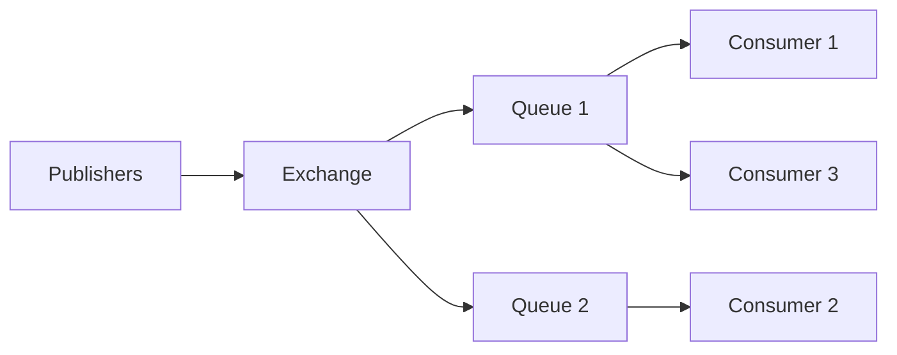
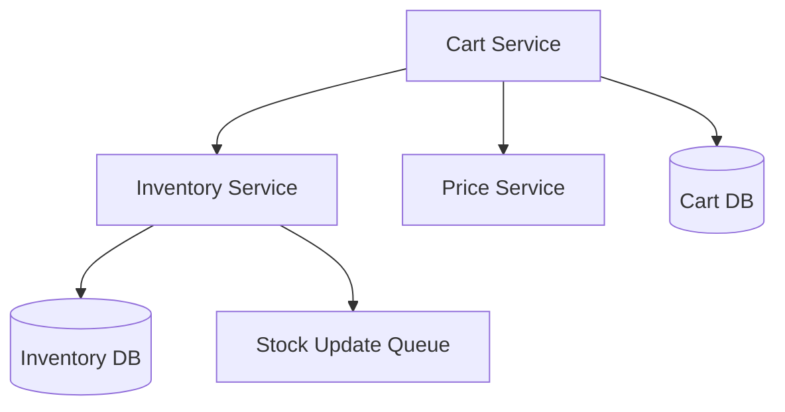
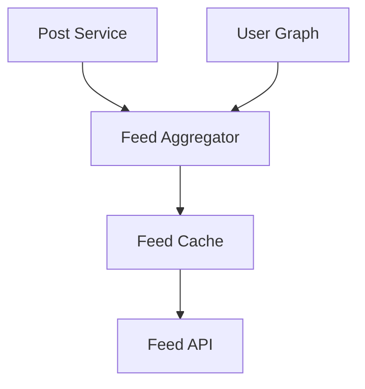
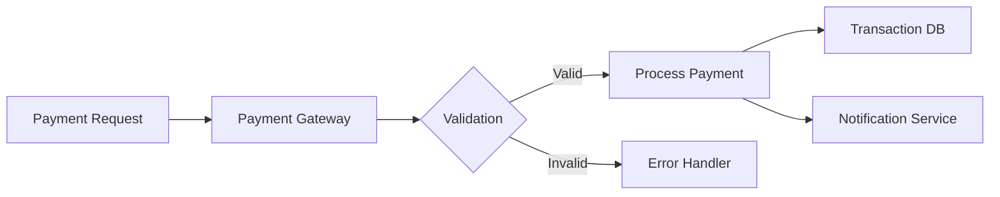
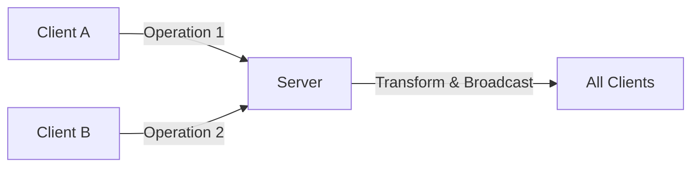
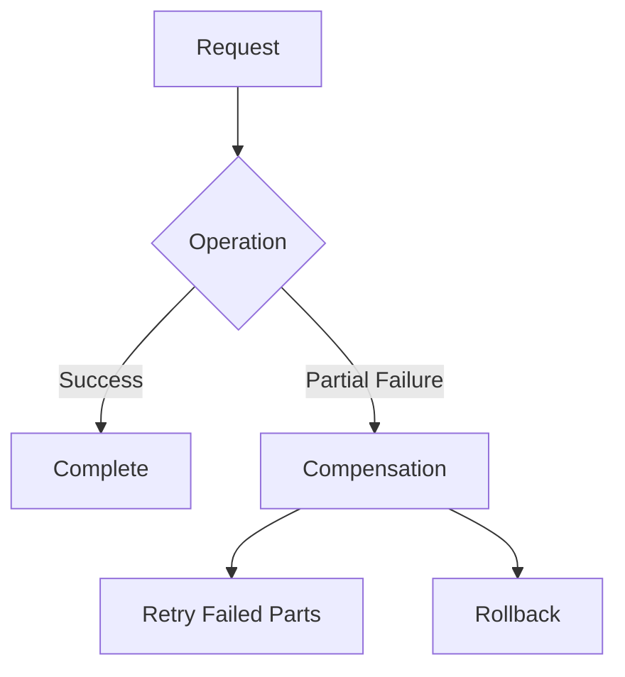
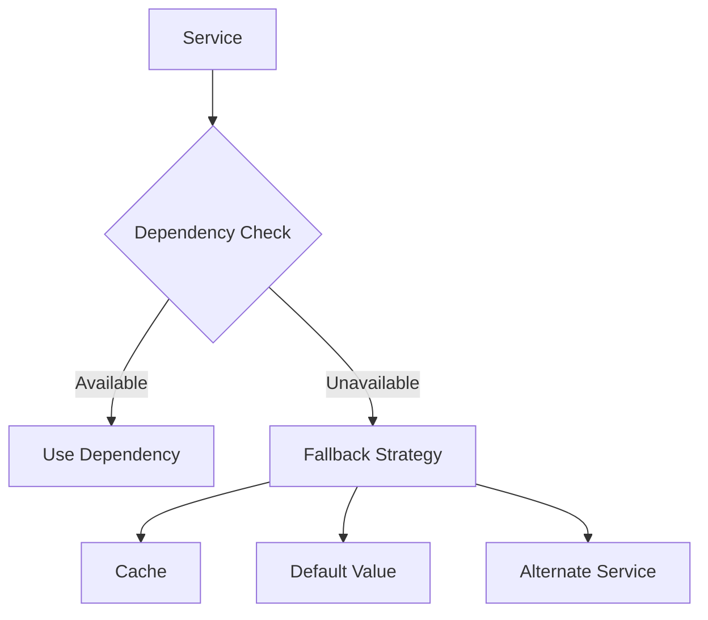
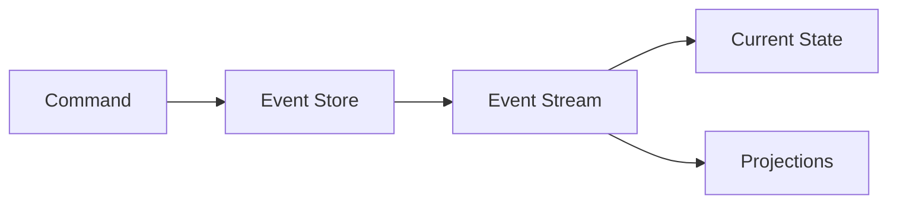
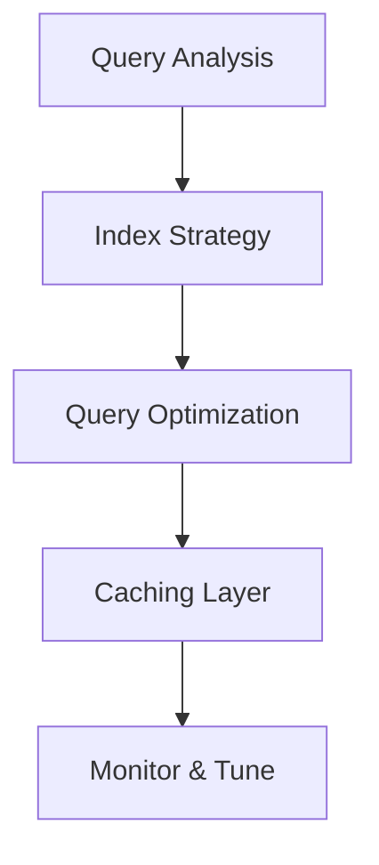

I'll break down these system design cases with clear explanations and diagrams. Let's focus on key components and their interactions.

1. Distributed Message Queue System (Like RabbitMQ):



Key Components:
```typescript
interface Message {
  id: string;
  payload: any;
  timestamp: number;
  status: 'pending' | 'processing' | 'completed';
}

interface Queue {
  name: string;
  messages: Message[];
  consumers: Consumer[];
  push(message: Message): void;
  poll(): Message;
}
```

2. Netflix Streaming Architecture:

```ascii
User Request Flow:
CDN Edge Location --> Load Balancer --> API Gateway
    |                                       |
    +--> Video Cache <---> Encoding Server <--> Original Content Storage
```

Key Considerations:
- Content Delivery Networks (CDN)
- Adaptive Bitrate Streaming
- Microservices Architecture
- Caching Strategies

3. E-commerce Cart System:



Implementation Focus:

```typescript
interface CartItem {
  productId: string;
  quantity: number;
  price: number;
  reservationId?: string;
}

class InventoryManager {
  async reserveStock(productId: string, quantity: number): Promise<string> {
    // Implement optimistic locking
    return reservationId;
  }
}
```

4. Uber Surge Pricing System:

```ascii
Real-time Data Collection
       │
       ▼
Supply/Demand Analysis
       │
       ▼
Price Multiplier Calculation
       │
       ▼
Dynamic Price Update
```

Key Components:
- Real-time demand tracking
- Geographic partitioning
- Price adjustment algorithms
- Event sourcing for price changes

5. Real-time Gaming Leaderboard:

```typescript
interface LeaderboardEntry {
  userId: string;
  score: number;
  rank: number;
  timestamp: number;
}

class LeaderboardService {
  private redis: Redis;
  private readonly LEADERBOARD_KEY = 'game:leaderboard';
  
  async updateScore(userId: string, score: number): Promise<void> {
    await this.redis.zadd(this.LEADERBOARD_KEY, score, userId);
  }
  
  async getRank(userId: string): Promise<number> {
    return this.redis.zrevrank(this.LEADERBOARD_KEY, userId);
  }
  
  async getTopPlayers(limit: number = 10): Promise<LeaderboardEntry[]> {
    const range = await this.redis.zrevrange(
      this.LEADERBOARD_KEY, 
      0, 
      limit - 1, 
      'WITHSCORES'
    );
    
    return this.formatLeaderboardEntries(range);
  }
  
  private formatLeaderboardEntries(redisResponse: string[]): LeaderboardEntry[] {
    // Transform Redis response into LeaderboardEntry objects
  }
}

```

6. Social Media News Feed:



Implementation Strategy:
- Fan-out on write for popular users
- Pull model for inactive users
- Ranking algorithm based on engagement

7. Distributed File Storage (Like Dropbox):

```ascii
Client                    Server
  │                         │
  ├─── File Change ──────►  │
  │                         ├── Metadata Update
  │ ◄── Sync Status ───────┤
  │                         ├── Block Storage
  ├─── Download Request ─►  │
  │                         │
  │ ◄── File Blocks ───────┤
```

Key Features:
- File chunking
- Deduplication
- Delta sync
- Versioning

8. Payment Processing System:



Implementation Example:

```typescript
interface PaymentRequest {
  amount: number;
  currency: string;
  paymentMethod: PaymentMethod;
  customerId: string;
}

class PaymentProcessor {
  async processPayment(request: PaymentRequest): Promise<PaymentResult> {
    // Start transaction
    const transaction = await this.beginTransaction();
    
    try {
      // Validate payment method
      await this.validatePayment(request);
      
      // Process through payment gateway
      const result = await this.gateway.charge(request);
      
      // Record transaction
      await this.recordTransaction(result);
      
      // Send notifications
      await this.notifyParties(result);
      
      return result;
    } catch (error) {
      await this.rollbackTransaction(transaction);
      throw error;
    }
  }
}
```

Common Considerations Across All Systems:
1. Scalability
   - Horizontal scaling
   - Load balancing
   - Data partitioning

2. Reliability
   - Redundancy
   - Fault tolerance
   - Error handling

3. Performance
   - Caching strategies
   - Optimization techniques
   - Monitoring and metrics

4. Security
   - Authentication
   - Authorization
   - Data encryption

Each system requires careful consideration of:
- CAP theorem trade-offs
- Data consistency models
- Failure scenarios
- Monitoring and alerting
- Cost optimization


---


### **1. How would you implement multi-level caching?**

**Solution**: Use multiple layers of caching (e.g., in-memory, distributed, and database caching) to optimize speed and availability.

```plaintext
[Client] --> In-Memory Cache (e.g., Redis) --> Persistent Cache (e.g., DB Cache)
          --> Database (Only if both caches miss)
```

**How it works**: Requests are served from the fastest layer (in-memory) if possible, then fall back to slower layers if necessary. This reduces database load while maintaining high availability.

---

### **2. Explain cache coherence strategies in distributed systems**

**Solution**: Use techniques like **write-through**, **write-behind**, or **eventual consistency** with tools like Redis or Memcached.

**How it works**: Cache coherence ensures all replicas or nodes in a distributed system reflect the same data. For example, event-driven updates can propagate changes across caches to avoid stale data.

---

### **3. How do you handle cache invalidation in microservices?**

**Solution**: Use a combination of TTL (time-to-live), event-based invalidation, or distributed cache invalidation using Pub/Sub systems.

```plaintext
[Cache] <-- Update Event --> [Service A] --> [Service B]
```

**How it works**: Invalidate stale data by setting expiration times (TTL) or broadcasting changes via message brokers like RabbitMQ or Kafka to synchronize caches.

---

### **4. Describe write-through vs write-back caching strategies**

**Solution**:  
- **Write-through**: Data is written to the cache and the database simultaneously.
- **Write-back**: Data is written to the cache and written to the database asynchronously.

**Example**:
```plaintext
Write-Through:
  Write Request --> [Cache + DB]

Write-Back:
  Write Request --> [Cache] --> Async Commit --> [DB]
```

**How it works**: Write-through ensures data consistency, while write-back improves write performance at the risk of data loss on cache failure.

---

### **5. How would you implement cache warming?**

**Solution**: Prepopulate the cache with frequently accessed data during initialization or after a cache purge.

```javascript
async function warmCache() {
  const popularItems = await db.query('SELECT * FROM popular_items');
  popularItems.forEach(item => cache.set(item.id, item));
}
```

**How it works**: Cache warming reduces initial latency for critical data by preloading the cache before requests arrive.

---

### **6. Explain strategies for caching GraphQL queries**

**Solution**: Cache the resolved responses for specific queries or cache individual resolvers at the field level.

**How it works**:  
- **Query-level caching**: Use tools like Apollo Server to cache query results.
- **Field-level caching**: Cache specific fields that are resource-intensive to compute.

```javascript
cache.set('query:user:123', userResponse);
```

**How it works**: This minimizes the computational overhead of frequently requested fields.

---

### **7. How do you handle cache stampede?**

**Solution**: Use techniques like **request coalescing**, **lazy caching**, and **randomized expiration**.

```javascript
async function fetchDataWithCoalescing(key, fetchFn) {
  if (cache.isRefreshing(key)) return cache.awaitRefresh(key);
  return cache.getOrFetch(key, fetchFn);
}
```

**How it works**: Request coalescing ensures only one request populates the cache, preventing overwhelming the backend during cache misses.

---

### **8. Describe caching patterns for real-time data**

**Solution**: Combine **time-based caching** with **event-driven updates** to balance freshness and performance.

```plaintext
Real-Time Updates --> Event Stream --> Cache Update
Periodic Refresh --> TTL Expiry --> Refresh Cache
```

**How it works**: Use TTL to limit the cache lifetime and event-driven updates to propagate changes in real-time, ensuring near-fresh data while reducing backend load.

---


I'll break down real-time data synchronization concepts with clear examples and practical implementations.

1. Real-time Editing Conflict Resolution:

Here's a simplified Operational Transform (OT) approach:



```typescript
interface TextOperation {
  type: 'insert' | 'delete';
  position: number;
  char?: string;
  timestamp: number;
  clientId: string;
}

class DocumentEditor {
  private text: string = '';
  private version: number = 0;

  applyOperation(op: TextOperation) {
    if (op.type === 'insert') {
      this.text = this.text.slice(0, op.position) + 
                  op.char + 
                  this.text.slice(op.position);
    } else {
      this.text = this.text.slice(0, op.position) + 
                  this.text.slice(op.position + 1);
    }
    this.version++;
  }
}
```

2. WebSocket Reconnection:
Implementing exponential backoff strategy:

```typescript
class WebSocketManager {
  private attempts = 0;
  private maxAttempts = 5;
  
  connect() {
    try {
      this.ws = new WebSocket(URL);
      this.setupListeners();
    } catch (err) {
      this.handleReconnect();
    }
  }

  private handleReconnect() {
    const backoff = Math.min(1000 * Math.pow(2, this.attempts), 10000);
    setTimeout(() => {
      this.attempts++;
      if (this.attempts < this.maxAttempts) {
        this.connect();
      }
    }, backoff);
  }
}
```

3. Data Consistency in Real-time Systems:

```ascii
Client State:               Server State:
┌──────────────┐           ┌──────────────┐
│ Local Store  │ ←──Sync───│ Source of    │
│ (Optimistic) │           │ Truth        │
└──────────────┘           └──────────────┘
```

Implementation approach:

```typescript
class StateManager {
  private localState: any = {};
  private pendingChanges: Set<string> = new Set();

  async updateState(key: string, value: any) {
    // Optimistic update
    this.localState[key] = value;
    this.pendingChanges.add(key);

    try {
      await this.syncWithServer(key, value);
      this.pendingChanges.delete(key);
    } catch (error) {
      // Rollback on failure
      this.handleSyncError(key);
    }
  }
}
```

4. Handling Out-of-order Messages:
Using a message queue with sequence numbers:

```typescript
interface Message {
  id: number;
  sequence: number;
  payload: any;
}

class MessageHandler {
  private messageQueue: Message[] = [];
  private currentSequence = 0;

  processMessage(message: Message) {
    this.messageQueue.push(message);
    this.messageQueue.sort((a, b) => a.sequence - b.sequence);
    this.processQueue();
  }

  private processQueue() {
    while (this.messageQueue.length > 0 && 
           this.messageQueue[0].sequence === this.currentSequence) {
      const message = this.messageQueue.shift();
      this.handleMessage(message);
      this.currentSequence++;
    }
  }
}
```

5. Server-Sent Events Implementation:

```typescript
// Server-side (Node.js/Express)
app.get('/events', (req, res) => {
  res.setHeader('Content-Type', 'text/event-stream');
  res.setHeader('Cache-Control', 'no-cache');
  res.setHeader('Connection', 'keep-alive');

  const sendEvent = (data: any) => {
    res.write(`data: ${JSON.stringify(data)}\n\n`);
  };

  // Handle client disconnect
  req.on('close', () => {
    // Cleanup
  });
});

// Client-side
class EventSourceManager {
  private es: EventSource;

  connect() {
    this.es = new EventSource('/events');
    this.es.onmessage = (event) => {
      const data = JSON.parse(event.data);
      this.handleEvent(data);
    };
  }
}
```

6. Real-time Data Aggregation:
Using a sliding window approach:

```typescript
class DataAggregator {
  private window: number = 5000; // 5 seconds
  private dataPoints: any[] = [];

  addDataPoint(data: any) {
    const now = Date.now();
    this.dataPoints.push({ ...data, timestamp: now });
    this.cleanOldData(now);
  }

  private cleanOldData(now: number) {
    const cutoff = now - this.window;
    this.dataPoints = this.dataPoints
      .filter(point => point.timestamp > cutoff);
  }

  getAggregatedData() {
    // Perform aggregation on this.dataPoints
    return this.calculateStatistics();
  }
}
```

7. Client-state Reconciliation:
Using version vectors:

```typescript
class StateReconciliation {
  private localState: any = {};
  private version: number = 0;

  async reconcile(serverState: any, serverVersion: number) {
    if (serverVersion > this.version) {
      // Server has newer state
      this.localState = serverState;
      this.version = serverVersion;
    } else if (serverVersion < this.version) {
      // Client has newer state
      await this.pushStateToServer();
    }
  }
}
```

8. Real-time Error Recovery:
Implementing circuit breaker pattern:

```typescript
class CircuitBreaker {
  private failures = 0;
  private lastFailure: number = 0;
  private threshold = 5;
  private timeout = 5000;

  async execute(fn: () => Promise<any>) {
    if (this.isOpen()) {
      throw new Error('Circuit is open');
    }

    try {
      const result = await fn();
      this.reset();
      return result;
    } catch (error) {
      this.recordFailure();
      throw error;
    }
  }

  private isOpen() {
    if (Date.now() - this.lastFailure > this.timeout) {
      return false;
    }
    return this.failures >= this.threshold;
  }
}
```

Key Principles Across All Implementations:
1. Always handle errors gracefully
2. Implement retry mechanisms with backoff
3. Maintain data consistency through versioning
4. Use optimistic updates for better UX
5. Keep track of system state
6. Implement proper cleanup mechanisms

These implementations provide a foundation that can be extended based on specific requirements and scale needs.


---

### **1. How would you implement horizontal scaling for stateful services?**

**Solution**: Use techniques like sticky sessions, distributed data stores, or service partitioning to maintain state consistency across scaled instances.

```plaintext
[Load Balancer] --> Instance A (State: User 1)  
                   Instance B (State: User 2)
```

**How it works**: Sticky sessions route users to the same instance based on cookies or IP. Alternatively, externalize state (e.g., using Redis) to make instances stateless, allowing seamless scaling.

---

### **2. Explain strategies for database sharding**

**Solution**: Split the database into smaller, independent shards based on a sharding key (e.g., user ID, region).

```plaintext
Shard 1: User IDs 1-1000 --> DB1  
Shard 2: User IDs 1001-2000 --> DB2
```

**How it works**: Each shard handles a subset of the data, reducing the load on individual databases and enabling parallel processing.

---

### **3. How do you handle hot partitions in distributed systems?**

**Solution**: Use techniques like consistent hashing, dynamic partitioning, or randomization.

```plaintext
Key Mapping --> [Node 1] [Node 2] [Node 3]  
Rebalance if Node 1 gets overloaded.
```

**How it works**: By redistributing keys dynamically or randomizing writes across partitions, the load is balanced to avoid hotspots.

---

### **4. Describe approaches for scaling WebSocket connections**

**Solution**: Use WebSocket servers with a load balancer and implement sticky sessions or distributed message brokers (e.g., Kafka).

```plaintext
[Load Balancer] --> WebSocket Server Cluster  
Message Broker --> Coordinate Messages Between Servers
```

**How it works**: Sticky sessions ensure connection persistence, while brokers distribute messages to connected clients across servers.

---

### **5. How would you implement backpressure handling?**

**Solution**: Use flow control mechanisms to slow down producers when consumers cannot keep up.

```javascript
stream.on('data', (chunk) => {
  if (!stream.write(chunk)) {
    stream.pause();
    stream.once('drain', () => stream.resume());
  }
});
```

**How it works**: This approach temporarily pauses data flow until the consumer is ready, preventing system overload.

---

### **6. Explain patterns for scaling search functionality**

**Solution**: Implement distributed search engines (e.g., Elasticsearch) with document partitioning and replication.

```plaintext
Index 1: Documents A-M --> Node 1  
Index 2: Documents N-Z --> Node 2
```

**How it works**: Partition indexes across nodes for parallel searches and replicate them to ensure fault tolerance.

---

### **7. How do you handle distributed session management?**

**Solution**: Use a centralized store like Redis or a session database.

```plaintext
Client --> Stateless Server --> Redis Session Store
```

**How it works**: Sessions are stored externally, enabling horizontal scaling without losing user state when switching servers.

---

### **8. Describe strategies for scaling file uploads**

**Solution**: Use a CDN for upload endpoints and direct uploads to cloud storage (e.g., AWS S3).

```plaintext
Client --> [CDN Upload Endpoint] --> [Cloud Storage]
```

**How it works**: The CDN handles upload traffic, while cloud storage ensures scalability. URLs are pre-signed for secure direct access.


--- 


I'll explain error handling and resilience patterns with practical examples and clear implementations.

1. Retry Mechanism with Exponential Backoff:

```typescript
class RetryHandler {
  private maxRetries = 3;
  private baseDelay = 1000; // 1 second

  async executeWithRetry<T>(operation: () => Promise<T>): Promise<T> {
    let retries = 0;
    
    while (true) {
      try {
        return await operation();
      } catch (error) {
        if (retries >= this.maxRetries) {
          throw error;
        }
        
        const delay = this.baseDelay * Math.pow(2, retries);
        const jitter = Math.random() * 100;
        await this.sleep(delay + jitter);
        
        retries++;
      }
    }
  }
}
```

2. Handling Partial Failures:



Implementation Example:
```typescript
interface OperationResult {
  success: boolean;
  failedItems: string[];
  successItems: string[];
}

class BatchProcessor {
  async processBatch(items: string[]): Promise<OperationResult> {
    const result: OperationResult = {
      success: true,
      failedItems: [],
      successItems: []
    };

    for (const item of items) {
      try {
        await this.processItem(item);
        result.successItems.push(item);
      } catch (error) {
        result.failedItems.push(item);
        result.success = false;
      }
    }

    return result;
  }
}
```

3. Graceful Degradation:

```ascii
Service Health:
Full → Degraded → Emergency → Offline
     ↑          ↑           ↑
  Feature    Capacity    Critical
  Reduction  Limits     Features Only
```

Example Implementation:

```typescript
class ServiceDegradation {
  private healthStatus = 'full';
  private featureFlags: Map<string, boolean> = new Map();

  setHealthStatus(status: string) {
    this.healthStatus = status;
    this.adjustFeatures();
  }

  private adjustFeatures() {
    switch (this.healthStatus) {
      case 'degraded':
        this.disableNonEssentialFeatures();
        break;
      case 'emergency':
        this.enableOnlyCriticalFeatures();
        break;
    }
  }
}
```

4. Timeout Handling:

Here's a practical timeout wrapper:

```typescript
async function withTimeout<T>(
  promise: Promise<T>, 
  timeoutMs: number
): Promise<T> {
  const timeout = new Promise((_, reject) => {
    setTimeout(() => {
      reject(new Error(`Operation timed out after ${timeoutMs}ms`));
    }, timeoutMs);
  });

  return Promise.race([promise, timeout]);
}

// Usage
try {
  const result = await withTimeout(fetchData(), 5000);
} catch (error) {
  if (error.message.includes('timed out')) {
    // Handle timeout specifically
  }
}
```

5. Bulkhead Pattern:
Isolating components to prevent cascade failures:

```typescript
class BulkheadManager {
  private pools: Map<string, Semaphore> = new Map();

  async executeWithBulkhead(
    name: string, 
    operation: () => Promise<any>,
    maxConcurrent: number
  ) {
    const semaphore = this.getOrCreateSemaphore(name, maxConcurrent);
    
    try {
      await semaphore.acquire();
      return await operation();
    } finally {
      semaphore.release();
    }
  }
}
```

6. Dependency Failure Handling:



Implementation:
```typescript
class DependencyManager {
  private cache: Map<string, any> = new Map();
  private circuitBreaker: CircuitBreaker;

  async executeWithFallback<T>(
    primary: () => Promise<T>,
    fallback: () => Promise<T>
  ): Promise<T> {
    try {
      return await this.circuitBreaker.execute(primary);
    } catch (error) {
      // Log dependency failure
      return await fallback();
    }
  }
}
```

7. Dead Letter Queue:

```typescript
interface DeadLetter {
  message: any;
  error: Error;
  attempts: number;
  timestamp: number;
}

class DeadLetterQueue {
  private queue: DeadLetter[] = [];
  private maxRetries = 3;

  async processDeadLetters() {
    for (const letter of this.queue) {
      if (letter.attempts < this.maxRetries) {
        try {
          await this.reprocess(letter);
          this.remove(letter);
        } catch (error) {
          letter.attempts++;
          // Update error information
        }
      } else {
        await this.notifyAdmin(letter);
      }
    }
  }
}
```

8. Rate Limit Error Handling:

```typescript
class RateLimitHandler {
  private tokenBucket = {
    tokens: 100,
    lastRefill: Date.now()
  };

  async executeWithRateLimit(operation: () => Promise<any>) {
    if (this.checkRateLimit()) {
      try {
        return await operation();
      } catch (error) {
        if (this.isRateLimitError(error)) {
          return await this.handleRateLimit(operation);
        }
        throw error;
      }
    }
    // Wait for token refresh
    await this.waitForTokens();
  }

  private handleRateLimit(operation: () => Promise<any>) {
    const backoff = Math.floor(Math.random() * 1000) + 1000;
    return new Promise(resolve => {
      setTimeout(() => resolve(operation()), backoff);
    });
  }
}
```

Key Principles to Remember:
1. Always fail gracefully
2. Log errors appropriately
3. Use timeouts for all external calls
4. Implement circuit breakers for dependencies
5. Have fallback strategies ready
6. Monitor and alert on error patterns

Best Practices:
- Use consistent error formats
- Implement proper logging
- Set up monitoring
- Have clear fallback strategies
- Test failure scenarios
- Document error handling approaches

These patterns can be combined and adapted based on your specific needs and system requirements.


---


I'll explain these advanced architectural patterns with practical examples and clear implementations.

1. Event Sourcing:
The core idea is to store state changes as a sequence of events.



Implementation Example:

```typescript
interface Event {
  id: string;
  type: string;
  data: any;
  timestamp: number;
  aggregateId: string;
}

class EventStore {
  private events: Event[] = [];
  private projections: Map<string, any> = new Map();

  append(event: Event) {
    this.events.push(event);
    this.updateProjections(event);
  }

  getEventsForAggregate(aggregateId: string): Event[] {
    return this.events.filter(e => e.aggregateId === aggregateId);
  }

  private updateProjections(event: Event) {
    const currentState = this.projections.get(event.aggregateId) || {};
    const newState = this.applyEvent(currentState, event);
    this.projections.set(event.aggregateId, newState);
  }
}
```

2. CQRS (Command Query Responsibility Segregation):

```ascii
Commands (Write)          Queries (Read)
     │                         │
     ▼                         ▼
Write Model ──────► Events ──► Read Model
```

```typescript
// Write side
class OrderCommandHandler {
  async createOrder(command: CreateOrderCommand): Promise<void> {
    const order = new Order(command);
    await this.orderRepository.save(order);
    await this.eventBus.publish(new OrderCreatedEvent(order));
  }
}

// Read side
class OrderQueryHandler {
  async getOrderSummary(orderId: string): Promise<OrderSummary> {
    return this.orderReadModel.findById(orderId);
  }
}
```

3. Distributed Transactions:
Using the Saga pattern for distributed transactions:


```typescript
class OrderSaga {
  private steps: SagaStep[] = [];
  private completedSteps: string[] = [];

  async execute() {
    for (const step of this.steps) {
      try {
        await step.execute();
        this.completedSteps.push(step.id);
      } catch (error) {
        await this.compensate();
        throw error;
      }
    }
  }

  private async compensate() {
    for (const stepId of this.completedSteps.reverse()) {
      const step = this.steps.find(s => s.id === stepId);
      await step.compensate();
    }
  }
}
```

4. Feature Toggles:

```typescript
class FeatureToggleService {
  private toggles: Map<string, boolean> = new Map();
  private conditions: Map<string, (context: any) => boolean> = new Map();

  isEnabled(feature: string, context?: any): boolean {
    if (this.conditions.has(feature)) {
      return this.conditions.get(feature)(context);
    }
    return this.toggles.get(feature) || false;
  }

  setToggle(feature: string, enabled: boolean) {
    this.toggles.set(feature, enabled);
  }

  setCondition(feature: string, condition: (context: any) => boolean) {
    this.conditions.set(feature, condition);
  }
}
```

5. Service Mesh Pattern:

```ascii
Service A  ─── Proxy ──╮
                      Load Balancer
Service B  ─── Proxy ──╯
```

Basic Implementation:

```typescript
class ServiceProxy {
  private retryHandler: RetryHandler;
  private circuitBreaker: CircuitBreaker;

  async forward(request: Request): Promise<Response> {
    return this.circuitBreaker.execute(async () => {
      return this.retryHandler.executeWithRetry(async () => {
        const response = await this.sendRequest(request);
        this.metrics.record(request, response);
        return response;
      });
    });
  }
}
```

6. API Gateway Implementation:

```typescript
class ApiGateway {
  private routes: Map<string, ServiceConfig> = new Map();
  private rateLimiter: RateLimiter;
  private auth: AuthService;

  async handleRequest(req: Request): Promise<Response> {
    // Authentication
    await this.auth.verify(req);

    // Rate limiting
    await this.rateLimiter.checkLimit(req);

    // Route to service
    const service = this.routes.get(req.path);
    if (!service) {
      throw new Error('Service not found');
    }

    // Forward request
    return await service.handle(req);
  }
}
```

7. Service Discovery:

```typescript
interface ServiceInstance {
  id: string;
  name: string;
  host: string;
  port: number;
  health: string;
}

class ServiceRegistry {
  private services: Map<string, ServiceInstance[]> = new Map();

  register(instance: ServiceInstance): void {
    const instances = this.services.get(instance.name) || [];
    instances.push(instance);
    this.services.set(instance.name, instances);
  }

  discover(serviceName: string): ServiceInstance {
    const instances = this.services.get(serviceName) || [];
    if (instances.length === 0) {
      throw new Error('No instances available');
    }
    // Simple round-robin selection
    return instances[Math.floor(Math.random() * instances.length)];
  }
}
```

8. Circuit Breaker:

```typescript
class CircuitBreaker {
  private failureCount: number = 0;
  private lastFailureTime: number = 0;
  private state: 'CLOSED' | 'OPEN' | 'HALF_OPEN' = 'CLOSED';
  
  private readonly FAILURE_THRESHOLD = 5;
  private readonly RESET_TIMEOUT = 60000; // 1 minute

  async execute<T>(operation: () => Promise<T>): Promise<T> {
    if (this.isOpen()) {
      throw new Error('Circuit breaker is open');
    }

    try {
      const result = await operation();
      this.onSuccess();
      return result;
    } catch (error) {
      this.onFailure();
      throw error;
    }
  }

  private isOpen(): boolean {
    if (this.state === 'OPEN') {
      const now = Date.now();
      if (now - this.lastFailureTime >= this.RESET_TIMEOUT) {
        this.state = 'HALF_OPEN';
        return false;
      }
      return true;
    }
    return false;
  }

  private onSuccess(): void {
    this.failureCount = 0;
    this.state = 'CLOSED';
  }

  private onFailure(): void {
    this.failureCount++;
    this.lastFailureTime = Date.now();
    if (this.failureCount >= this.FAILURE_THRESHOLD) {
      this.state = 'OPEN';
    }
  }
}
```

Key Implementation Principles:
1. Separation of Concerns
2. Single Responsibility
3. Fault Tolerance
4. Monitoring & Observability
5. Configuration Management

Best Practices:
- Implement proper logging
- Add metrics collection
- Use appropriate error handling
- Include health checks
- Implement proper testing
- Document failure scenarios

These patterns can be combined and adapted based on your specific needs and system requirements.


---


I'll explain these performance optimization patterns with practical examples and clear implementations.

1. Database Query Optimization:



Implementation Example:
```typescript
class QueryOptimizer {
  private cache: Map<string, any> = new Map();
  private queryStats: Map<string, QueryMetrics> = new Map();

  async executeQuery(query: string, params: any[]): Promise<any> {
    const cacheKey = this.getCacheKey(query, params);
    
    // Check cache first
    if (this.cache.has(cacheKey)) {
      return this.cache.get(cacheKey);
    }

    const startTime = Date.now();
    const result = await this.executeWithPool(query, params);
    this.updateQueryStats(query, Date.now() - startTime);

    // Cache if appropriate
    if (this.shouldCache(query)) {
      this.cache.set(cacheKey, result);
    }

    return result;
  }

  private shouldCache(query: string): boolean {
    const stats = this.queryStats.get(query);
    return stats.avgTime > 100 && stats.frequency > 10;
  }
}
```

2. API Latency Reduction:

```typescript
class ApiOptimizer {
  private cache: ResponseCache;
  private compression: CompressionService;

  async handleRequest(req: Request): Promise<Response> {
    // Check cache
    const cachedResponse = await this.cache.get(req.url);
    if (cachedResponse) {
      return cachedResponse;
    }

    // Process request
    const response = await this.processRequest(req);

    // Compress response
    const compressed = await this.compression.compress(response);

    // Cache result
    await this.cache.set(req.url, compressed);

    return compressed;
  }
}
```

3. Efficient Batch Processing:

```typescript
class BatchProcessor<T> {
  private batchSize: number = 1000;
  private queue: T[] = [];
  private processing: boolean = false;

  async add(item: T): Promise<void> {
    this.queue.push(item);
    
    if (this.queue.length >= this.batchSize && !this.processing) {
      await this.processBatch();
    }
  }

  private async processBatch(): Promise<void> {
    this.processing = true;
    const batch = this.queue.splice(0, this.batchSize);

    await Promise.all(
      chunk(batch, 100).map(async items => {
        await this.processItems(items);
      })
    );

    this.processing = false;
  }
}
```

4. Asset Delivery Optimization:

```typescript
class AssetOptimizer {
  private cdn: CDNService;
  private imageProcessor: ImageProcessor;

  async optimizeImage(image: Buffer): Promise<string> {
    // Optimize image
    const optimized = await this.imageProcessor.optimize(image, {
      quality: 80,
      format: 'webp'
    });

    // Generate variants
    const variants = await Promise.all([
      this.generateVariant(optimized, { width: 320 }),
      this.generateVariant(optimized, { width: 640 }),
      this.generateVariant(optimized, { width: 1280 })
    ]);

    // Upload to CDN
    const urls = await Promise.all(
      variants.map(v => this.cdn.upload(v))
    );

    return this.generateSrcSet(urls);
  }
}
```

5. Request Collapsing:

```typescript
class RequestCollapser {
  private pendingRequests: Map<string, Promise<any>> = new Map();

  async execute(key: string, operation: () => Promise<any>): Promise<any> {
    // Check if request is already in progress
    if (this.pendingRequests.has(key)) {
      return this.pendingRequests.get(key);
    }

    // Execute new request
    const promise = operation().finally(() => {
      this.pendingRequests.delete(key);
    });

    this.pendingRequests.set(key, promise);
    return promise;
  }
}
```

6. Memory Usage Optimization:

```typescript
class MemoryOptimizer {
  private memoryPool: WeakMap<object, any> = new WeakMap();
  private gcThreshold: number = 0.8; // 80% memory usage

  async handleOperation<T>(operation: () => Promise<T>): Promise<T> {
    const memoryUsage = process.memoryUsage().heapUsed / 
                       process.memoryUsage().heapTotal;

    if (memoryUsage > this.gcThreshold) {
      this.triggerGC();
    }

    try {
      return await operation();
    } finally {
      this.cleanup();
    }
  }

  private cleanup() {
    // Cleanup references
    this.memoryPool = new WeakMap();
  }
}
```

7. Connection Pooling:

```typescript
class ConnectionPool {
  private pool: Connection[] = [];
  private inUse: Set<Connection> = new Set();
  private maxSize: number = 10;

  async getConnection(): Promise<Connection> {
    // Check for available connection
    const connection = this.pool.find(c => !this.inUse.has(c));
    
    if (connection) {
      this.inUse.add(connection);
      return connection;
    }

    // Create new connection if pool not full
    if (this.pool.length < this.maxSize) {
      const newConnection = await this.createConnection();
      this.pool.push(newConnection);
      this.inUse.add(newConnection);
      return newConnection;
    }

    // Wait for available connection
    return new Promise(resolve => {
      this.waitForConnection().then(resolve);
    });
  }
}
```

8. Background Job Optimization:

```typescript
class JobScheduler {
  private queues: Map<string, Job[]> = new Map();
  private processing: boolean = false;
  private concurrency: number = 3;

  async addJob(job: Job): Promise<void> {
    const queue = this.queues.get(job.priority) || [];
    queue.push(job);
    this.queues.set(job.priority, queue);

    if (!this.processing) {
      this.processJobs();
    }
  }

  private async processJobs(): Promise<void> {
    this.processing = true;

    while (this.hasJobs()) {
      const batch = this.getNextBatch();
      await Promise.all(
        batch.map(job => this.processJob(job))
      );
    }

    this.processing = false;
  }

  private async processJob(job: Job): Promise<void> {
    try {
      await job.execute();
    } catch (error) {
      await this.handleJobError(job, error);
    }
  }
}
```

Key Optimization Principles:
1. Measure First
2. Cache Strategically
3. Batch Operations
4. Use Appropriate Data Structures
5. Monitor Resource Usage

Best Practices:
- Set up proper monitoring
- Implement performance metrics
- Use profiling tools
- Set up alerts for degradation
- Document optimization strategies
- Regular performance testing

These patterns should be:
- Measurable
- Maintainable
- Scalable
- Monitored
- Documented

Remember to always measure the impact of optimizations and ensure they actually improve performance in your specific use case.