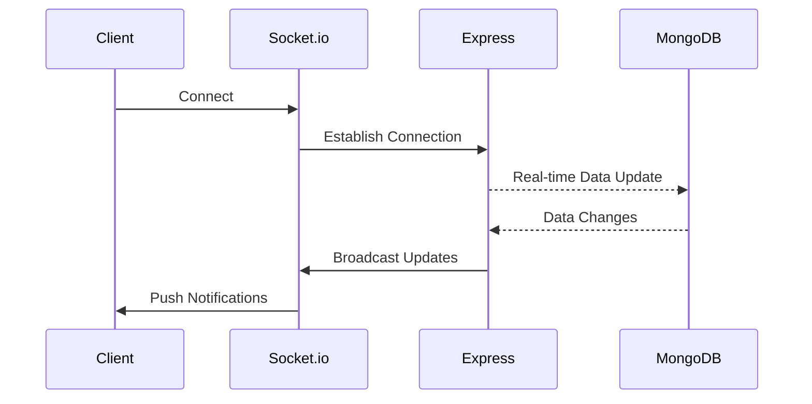
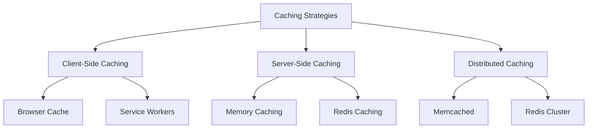
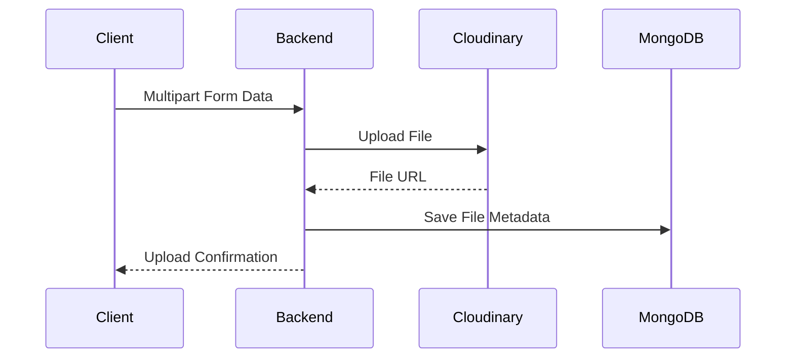
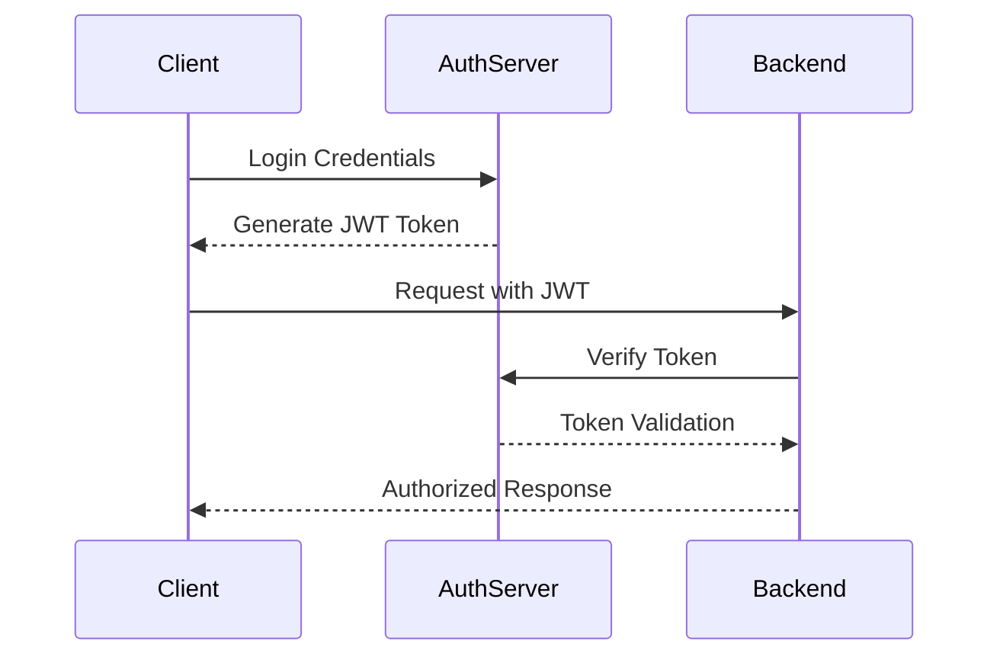
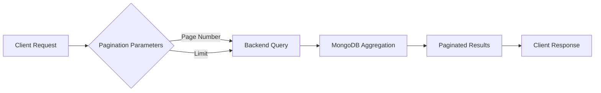

### **Basics of System Design (Overview)**

System design involves planning and structuring complex software systems in a way that meets specific business needs while being scalable, maintainable, and efficient. Below are the key concepts:

---

### **1. High-Level Architecture**

- **Client-Server Model**: The system is divided into clients (who request services) and servers (who provide services). A typical web app follows this model with a frontend (client) and backend (server).
  
- **Microservices**: Instead of a monolithic architecture, break the system into small, independent services that communicate via APIs, improving scalability and maintainability.

- **Monolithic vs. Distributed**: 
  - **Monolithic**: One unified codebase.
  - **Distributed**: Multiple independent services communicating with each other.

---

### **2. Scalability**

- **Horizontal Scaling**: Adding more machines (servers) to handle increased load. It is cost-effective and scalable.
  
- **Vertical Scaling**: Increasing the resources (CPU, memory) of a single machine. It’s simpler but has a limit.

- **Load Balancing**: Distributes incoming requests across multiple servers to prevent overload on a single server.

---

### **3. Caching**

- **Purpose**: Reduces database load and improves performance by storing frequently accessed data in memory (e.g., Redis, Memcached).
  
- **Cache Invalidation**: Ensuring that stale data in cache is updated when the source data changes.

---

### **4. Database Design**

- **Relational vs. NoSQL**: 
  - **Relational Databases (SQL)**: Structured data, ACID transactions (e.g., PostgreSQL, MySQL).
  - **NoSQL Databases**: Schema-less, flexible for large, unstructured data (e.g., MongoDB, Cassandra).

- **Sharding**: Distributes data across multiple databases to handle large amounts of data.

---

### **5. Consistency, Availability, and Partition Tolerance (CAP Theorem)**

- **Consistency**: All nodes in the system have the same data at any given time.
- **Availability**: Every request receives a response, but not necessarily the most recent data.
- **Partition Tolerance**: The system continues to function even if network partitions occur between nodes.

---

### **6. Redundancy and Fault Tolerance**

- **Redundancy**: Duplication of critical components or systems to ensure reliability.
  
- **Failover Mechanism**: Automatically switching to a backup system in case of failure.

---

### **7. APIs and Communication**

- **RESTful APIs**: Standardized way to communicate between services using HTTP methods.
  
- **gRPC**: High-performance, language-agnostic communication protocol for services.

- **Message Queues**: Asynchronous communication between services (e.g., RabbitMQ, Kafka).

---

### **8. Security Considerations**

- **Authentication**: Ensuring users are who they say they are (e.g., JWT, OAuth).
  
- **Authorization**: Ensuring users have permission to access specific resources.

- **Data Encryption**: Protecting sensitive data during transit (TLS) and at rest (AES encryption).

---

### **9. Monitoring and Logging**

- **Logging**: Helps in tracking the activities of the system and debugging issues (e.g., ELK stack, Splunk).
  
- **Monitoring**: Tracking system health and performance (e.g., Prometheus, Grafana).

---

### **10. Load Testing and Performance Optimization**

- **Stress Testing**: Identifying the breaking point of your system under heavy load.
  
- **Latency and Throughput**: Measuring how long requests take and how many requests the system can handle per second.

---

### **Key Steps in System Design**

1. **Requirements Gathering**: Understand the problem and what the system needs to do.
2. **Define System Constraints**: Consider constraints like performance, scalability, and availability.
3. **High-Level Design**: Break the system into components and design the architecture.
4. **Database Design**: Define the data models and how they will be stored.
5. **Define APIs**: Design the communication between components.
6. **Handling Edge Cases**: Consider scenarios like failures, outages, and high traffic.
7. **Scaling Strategy**: Decide how to scale the system as it grows.


----
Here are 10 essential Next.js interview questions, ranging from basic to advanced topics:

### 1. **What is Next.js and how does it differ from React?**
   - **Answer**: Next.js is a React framework that provides server-side rendering (SSR), static site generation (SSG), and automatic code splitting. Unlike React, which focuses on building components and rendering on the client-side, Next.js helps in building full-fledged applications with optimizations for performance, SEO, and routing out-of-the-box.

### 2. **What are the benefits of using SSR (Server-Side Rendering) in Next.js?**
   - **Answer**: SSR improves SEO by rendering the page on the server and sending the fully rendered HTML to the client. This helps search engines index the content more effectively. It also speeds up initial page load, especially for content-heavy pages, and provides better user experience on slower networks.

### 3. **What is Static Site Generation (SSG) in Next.js?**
   - **Answer**: SSG is the process of pre-rendering pages at build time, meaning the HTML is generated ahead of time and served as static files. This makes it faster than SSR since there’s no server-side computation on each request. It's useful for pages with data that doesn't change frequently.

### 4. **How do you implement dynamic routes in Next.js?**
   - **Answer**: In Next.js, dynamic routes are created using the file system. For example, creating a file named `[id].js` inside the `pages` directory will automatically handle dynamic routing for URLs like `/post/1`, `/post/2`, etc. You can access the dynamic part of the route using the `useRouter` hook or `getServerSideProps`.

### 5. **Explain `getServerSideProps` and `getStaticProps` in Next.js.**
   - **Answer**: 
     - `getServerSideProps` is used for server-side rendering. It runs on every request and fetches data on the server before rendering the page.
     - `getStaticProps` is used for static site generation. It runs at build time, fetching data to generate static HTML, and is ideal for content that doesn’t change frequently.

### 6. **What is Incremental Static Regeneration (ISR) in Next.js?**
   - **Answer**: ISR allows you to update static content after the site has been built and deployed. With ISR, pages are generated on-demand the first time they are requested and then cached. You can set a revalidation time to update static pages periodically without needing a full rebuild.

### 7. **How does Next.js handle API routes?**
   - **Answer**: Next.js allows you to build API routes directly in the `pages/api` directory. These routes are serverless functions that can handle requests like GET, POST, PUT, etc. This allows you to build the backend logic within the same application as your frontend.

### 8. **What is `useRouter` in Next.js and how is it used?**
   - **Answer**: `useRouter` is a hook provided by Next.js to access the router object. It allows you to get information about the current route, like query parameters, pathname, and perform navigation actions (e.g., redirecting to another page).

### 9. **How does code splitting work in Next.js?**
   - **Answer**: Next.js automatically splits the code by page. When you visit a page, only the JavaScript needed for that page is loaded, reducing the initial load time. It uses dynamic imports to split code into smaller bundles, which improves performance and speeds up the app.

### 10. **How do you handle SEO optimization in Next.js?**
   - **Answer**: Next.js provides built-in support for SEO through SSR and SSG, which ensures that search engines can index fully-rendered pages. You can use the `Head` component from Next.js to modify metadata like title, description, and other meta tags for each page to improve SEO.
---


### Patch 2 & With more Frequent Questions 


1. Redis (Mid Level):
### **1. How does Redis implement pub/sub messaging?**

Redis uses **Pub/Sub** to enable real-time communication between publishers and subscribers.  

**How it works**:  
1. A **publisher** sends messages to a specific channel.  
2. Multiple **subscribers** listening to the channel receive the messages.  

**Code Example**:  
Publisher:
```js
const redis = require('redis');
const publisher = redis.createClient();
publisher.publish('channel', 'Hello, Redis!');
```

Subscriber:
```js
const subscriber = redis.createClient();
subscriber.subscribe('channel');
subscriber.on('message', (channel, message) => {
    console.log(`Received: ${message} on ${channel}`);
});
```

---

### **2. Explain Redis clustering and its benefits**

Redis clustering partitions data across multiple nodes to improve scalability and fault tolerance.

**How it works**:
- **Sharding**: Data is divided using hash slots.
- **Replication**: Each node has replicas for redundancy.

**Benefits**:  
- Horizontal scalability (large datasets).  
- High availability (node failure doesn't cause data loss).  
- Load balancing across nodes.  

**Diagram**:
```plaintext
[Node A] --> [Replica A1, A2]
[Node B] --> [Replica B1, B2]
```

---

### **3. What are Redis transactions? How do they work?**

Redis transactions execute multiple commands in a single operation using `MULTI` and `EXEC`.

**Steps**:
1. **Start transaction**: `MULTI`.  
2. **Queue commands**.  
3. **Execute transaction**: `EXEC`.  

**Example**:
```js
const redis = require('redis');
const client = redis.createClient();

client.multi()
  .set('key1', 'value1')
  .incr('counter')
  .exec((err, replies) => {
      console.log(replies); // ['OK', 1]
  });
```

**Notes**:
- Transactions are atomic.  
- If an error occurs, other commands still execute.

---

### **4. How would you implement rate limiting using Redis?**

**Rate limiting** controls the number of actions a user can perform in a time window.  

**Approach**: Use the Redis `INCR` command with an expiration.  

**Example**:
```js
const client = redis.createClient();
const limit = 5; // 5 requests
const window = 60; // 60 seconds

function rateLimiter(userId) {
    const key = `rate:${userId}`;
    client.incr(key, (err, count) => {
        if (count === 1) client.expire(key, window);
        if (count > limit) {
            console.log('Rate limit exceeded');
        } else {
            console.log('Request allowed');
        }
    });
}
```

---

### **5. Describe Redis replication and its failure scenarios**

**Replication** creates read-only replicas of a master node.  

**How it works**:
- **Master** node handles writes.  
- **Replicas** sync data from the master and handle reads.

**Failure Scenarios**:
1. **Master Failure**:  
   - Requires manual failover or Sentinel to promote a replica to master.
2. **Replica Failure**:  
   - Data remains intact on the master; new replicas can be re-synced.

**Benefits**:  
- High availability.  
- Load balancing (read-heavy workloads).  

**Diagram**:
```plaintext
Master --> Replica1, Replica2, Replica3
```

   
2. SQL/PostgreSQL/MySQL (Mixed Levels):
### **1. Explain window functions in SQL with examples (Advanced)**  

Window functions perform calculations across a **subset of rows** related to the current row without collapsing rows, unlike aggregate functions.  

**Common Functions**:  
- `ROW_NUMBER()`: Assigns a unique number.  
- `RANK()`: Provides a rank with gaps for ties.  
- `SUM()`, `AVG()`, etc., calculated over partitions.

**Example**:  
Rank employees by salary within departments:  
```sql
SELECT 
    department_id, 
    employee_id, 
    salary,
    RANK() OVER (PARTITION BY department_id ORDER BY salary DESC) AS rank
FROM employees;
```

**Output**:  
| department_id | employee_id | salary | rank |  
|---------------|-------------|--------|------|  
| 1             | 101         | 5000   | 1    |  
| 1             | 102         | 4500   | 2    |  

---

### **2. How do you handle race conditions in database transactions? (Advanced)**  

**Race conditions** occur when multiple transactions access the same data simultaneously, leading to conflicts.  

**Solutions**:
1. **Locking**:  
   - Use row or table-level locks (`FOR UPDATE`).  
   - Prevents multiple updates at the same time.  

   **Example**:  
   ```sql
   BEGIN;
   SELECT balance FROM accounts WHERE id = 1 FOR UPDATE;
   UPDATE accounts SET balance = balance - 100 WHERE id = 1;
   COMMIT;
   ```

2. **Optimistic Concurrency Control**:  
   - Use versioning to detect conflicts.  
   - Check a version/timestamp before updating.  

   **Example**:  
   ```sql
   UPDATE accounts
   SET balance = balance - 100, version = version + 1
   WHERE id = 1 AND version = 10;
   ```

3. **Retry Logic**:  
   - Handle conflicts programmatically and retry failed transactions.

---

### **3. What are materialized views and when would you use them? (Mid)**  

**Materialized Views** store the results of a query physically on disk, unlike regular views which are virtual.

**Use Cases**:
- Precomputed results for complex queries (e.g., aggregations).  
- Performance boost for read-heavy operations.  

**Example**:
```sql
CREATE MATERIALIZED VIEW sales_summary AS
SELECT product_id, SUM(sales) AS total_sales
FROM sales
GROUP BY product_id;
```

**Refresh Strategies**:  
- **Manual**: `REFRESH MATERIALIZED VIEW sales_summary;`  
- **Automatic**: Scheduled updates.

---

### **4. Explain query execution plans and how to interpret them (Advanced)**  

A **query execution plan** shows the steps a database takes to execute a query.  

**Key Commands**:  
- PostgreSQL: `EXPLAIN` or `EXPLAIN ANALYZE`.  

**Example**:
```sql
EXPLAIN ANALYZE 
SELECT * FROM employees WHERE department_id = 10;
```

**Output Components**:
1. **Seq Scan**: Scans the table sequentially.  
2. **Index Scan**: Uses an index for faster lookups.  
3. **Cost**: Estimated cost for the operation.  

**Optimizing**:
- Add indexes for high-cost sequential scans.  
- Avoid unnecessary joins or subqueries.

---

### **5. What is the difference between DELETE and TRUNCATE? (Beginner)**  

| **DELETE**                               | **TRUNCATE**                           |  
|------------------------------------------|----------------------------------------|  
| Removes specific rows.                   | Removes all rows from a table.         |  
| Can have a `WHERE` clause.               | Cannot use a `WHERE` clause.           |  
| Slower (logs each row deletion).         | Faster (minimal logging).              |  
| Can trigger constraints and triggers.    | Does not trigger constraints/triggers. |  

**Examples**:  
```sql
DELETE FROM employees WHERE id = 101;  -- Deletes one row.
TRUNCATE TABLE employees;             -- Deletes all rows.  
```
---

3. NodeJS (Mid-Advanced):
### **1. How does the Node.js garbage collector work?**  

The **Node.js garbage collector**, part of **V8**, reclaims memory by removing unused objects. It uses:  
1. **Generational GC**: Separates memory into *young* and *old* generations.  
2. **Mark-and-Sweep Algorithm**: Marks reachable objects and sweeps unmarked ones for deallocation.  

**Phases**:  
- Allocation: Memory is assigned.  
- Marking: Active objects are marked.  
- Sweeping: Unmarked memory is cleared.  
- Compacting: Fragments are defragmented.  

**Optimization**: Use smaller objects and avoid memory leaks (e.g., global variables).

---

### **2. Explain middleware in Express.js and its common use cases**  

Middleware functions are functions that execute before your route handlers in Express.js. They have access to `req`, `res`, and `next`.

**Common Use Cases**:  
1. **Logging**: Monitor requests.  
   ```js
   app.use((req, res, next) => {
     console.log(`${req.method} ${req.url}`);
     next();
   });
   ```
2. **Authentication**: Verify tokens or user sessions.  
3. **Error Handling**: Catch errors globally.  
   ```js
   app.use((err, req, res, next) => {
     res.status(500).send('Something broke!');
   });
   ```
4. **Static Files**: Serve assets like images or CSS.  
   ```js
   app.use(express.static('public'));
   ```

---

### **3. How do you handle errors in asynchronous code?**  

**1. Using `try...catch`**:  
   ```js
   app.get('/route', async (req, res) => {
     try {
       const data = await someAsyncOperation();
       res.send(data);
     } catch (error) {
       res.status(500).send('Error occurred');
     }
   });
   ```

**2. Using `.catch()`**:  
   ```js
   someAsyncOperation()
     .then(data => res.send(data))
     .catch(err => res.status(500).send('Error occurred'));
   ```

**3. Global Error Handler** with `express-async-errors`:  
   ```js
   require('express-async-errors'); // Wraps all async routes
   ```

---

### **4. What are Worker Threads and when should you use them?**  

**Worker Threads** enable Node.js to run CPU-intensive tasks in separate threads, avoiding blocking the main event loop.

**Use Cases**:  
- **CPU-bound tasks**: Image processing, large computations.  
- **Parallel processing**: Data-intensive operations.

**Example**:  
```js
const { Worker } = require('worker_threads');

const worker = new Worker('./worker.js', { workerData: { task: 'processData' } });

worker.on('message', result => console.log(result));
worker.on('error', err => console.error(err));
```

**Worker Script (`worker.js`)**:  
```js
const { parentPort, workerData } = require('worker_threads');
parentPort.postMessage(`Task ${workerData.task} completed!`);
```

---

### **5. Explain the difference between `res.send()`, `res.json()`, and `res.end()`**  

| Method        | Purpose                                                                 | Example                              |  
|---------------|-------------------------------------------------------------------------|--------------------------------------|  
| `res.send()`  | Sends a response (string, buffer, or object).                          | `res.send('Hello')`                 |  
| `res.json()`  | Sends a JSON response and sets `Content-Type: application/json`.       | `res.json({ message: 'Hello' })`    |  
| `res.end()`   | Ends the response without data. Useful for streams.                   | `res.end()`                         |  

**Usage**:  
- Use `res.send()` for most responses.  
- Use `res.json()` specifically for JSON APIs.  
- Use `res.end()` when sending raw data or manually streaming.

  
4. ReactJS (Mid-Advanced):
### **1. Explain React's Reconciliation Algorithm**  
React’s reconciliation algorithm determines how to efficiently update the DOM when the state or props change.  

Key principles:  
1. **Diffing**: React compares the Virtual DOM tree with its previous version.  
2. **Heuristics**: 
   - Same type of element → Updates attributes.  
   - Different types → Removes and recreates the node.  
3. **Key Prop**: Helps React efficiently reorder list items.  

**Example**:  
```jsx
<ul>
  {items.map(item => (
    <li key={item.id}>{item.text}</li>
  ))}
</ul>
```

---

### **2. How do you optimize React performance?**  

**1. Memoization**:  
Use `React.memo` for functional components and `useMemo`/`useCallback` for values or functions.  
```jsx
const memoizedValue = useMemo(() => computeExpensiveValue(a, b), [a, b]);
```

**2. Code Splitting**:  
Lazy load components.  
```jsx
const LazyComponent = React.lazy(() => import('./LazyComponent'));
```

**3. Avoid Re-renders**:  
Use `shouldComponentUpdate` or `React.memo`.  

**4. Use Immutable Data**:  
Avoid direct state mutation.

---

### **3. What are React Portals and when would you use them?**  

**React Portals** allow rendering children into a DOM node outside the parent hierarchy.  
**Use Cases**:  
- Modals, tooltips, pop-ups.

**Example**:  
```jsx
ReactDOM.createPortal(
  <div className="modal">I am a portal!</div>,
  document.getElementById('modal-root')
);
```

---

### **4. Explain Context API vs Redux - When to use each?**  

| **Feature**       | **Context API**                           | **Redux**                              |  
|--------------------|-------------------------------------------|----------------------------------------|  
| **Use Case**       | Simple state sharing                     | Complex state management               |  
| **Scope**          | Localized to app or component tree       | Global and multi-layered applications  |  
| **Middleware**     | None                                     | Supports middleware like `redux-thunk` |  
| **Boilerplate**    | Minimal                                  | Higher setup cost                      |  

**Guideline**:  
- Use **Context API** for small apps or sharing global values (e.g., theme).  
- Use **Redux** for larger apps with complex state logic.

---

### **5. How do you handle side effects in React components?**  

Use the **`useEffect` hook** or external libraries like Redux Thunk/Saga.  

**Example**:  
Fetch data with `useEffect`:  
```jsx
useEffect(() => {
  const fetchData = async () => {
    const response = await fetch('/api/data');
    setData(await response.json());
  };
  fetchData();
}, [dependency]); // Only run when `dependency` changes
```

For more complex scenarios (e.g., debouncing, API calls), you might use **custom hooks** or **state management middleware**.


5. Docker (Mid-Advanced):
### **1. Explain Multi-Stage Builds in Docker**  

Multi-stage builds allow you to use multiple `FROM` statements in a single Dockerfile, reducing the final image size by only including necessary files in the production image.

**Use Case**: Build and compile an app in one stage, then copy the output to a lighter runtime environment.

**Example**:  
```Dockerfile
# Stage 1: Build
FROM node:16 as builder
WORKDIR /app
COPY package*.json ./
RUN npm install
COPY . .
RUN npm run build

# Stage 2: Production
FROM nginx:alpine
COPY --from=builder /app/build /usr/share/nginx/html
```
- The `builder` stage compiles the app.
- The final image only includes the compiled output, making it smaller.

---

### **2. How Do You Handle Secrets in Docker?**  

**Best Practices**:  
1. **Docker Secrets (Swarm mode)**: Store secrets securely and inject them at runtime.  
   ```bash
   echo "my-secret-value" | docker secret create my_secret -
   ```
   Use secrets in services:  
   ```yaml
   services:
     app:
       secrets:
         - my_secret
   ```

2. **Environment Variables**: Pass secrets via `docker-compose` (use `.env` files).  
   ```yaml
   environment:
     DB_PASSWORD: ${DB_PASSWORD}
   ```

3. **External Secret Management**: Use tools like **HashiCorp Vault** or **AWS Secrets Manager** for production-grade security.

**Avoid**:  
- Hardcoding secrets in Dockerfiles or source code.  
- Including `.env` files in version control.

---

### **3. What is Docker Swarm and How Does It Work?**  

**Docker Swarm** is a native container orchestration tool for managing clusters of Docker nodes.  

**Key Concepts**:  
- **Manager Nodes**: Manage the cluster and distribute tasks to worker nodes.  
- **Worker Nodes**: Execute tasks assigned by managers.  
- **Services**: Define how tasks (containers) are distributed across the cluster.

**Workflow**:
1. Initialize a Swarm:  
   ```bash
   docker swarm init
   ```
2. Add nodes to the Swarm:  
   ```bash
   docker swarm join --token <manager-token> <manager-ip>
   ```
3. Deploy a service:  
   ```bash
   docker service create --replicas 3 nginx
   ```

**Benefits**: High availability, load balancing, and simple scaling.

---

### **4. Explain Docker Health Checks**  

Docker **health checks** monitor the health of a container by running a custom command or script inside the container.

**Example**:  
Add a health check in a Dockerfile:
```Dockerfile
HEALTHCHECK --interval=30s --timeout=5s --retries=3 CMD curl -f http://localhost:3000/health || exit 1
```
- **Parameters**:
  - `--interval`: Time between checks (e.g., 30 seconds).
  - `--timeout`: Max time for the check to complete.
  - `--retries`: Number of failures before marking as unhealthy.

**Benefits**:  
- Automatically restart unhealthy containers.  
- Useful for monitoring service readiness.

---

### **5. How Do You Implement CI/CD with Docker?**  

Docker integrates seamlessly into CI/CD pipelines to automate building, testing, and deployment.

**Steps**:
1. **Build the Docker Image**:  
   ```bash
   docker build -t my-app:latest .
   ```

2. **Run Tests Inside a Container**:  
   ```bash
   docker run --rm my-app:latest npm test
   ```

3. **Push to a Registry**:  
   Push the built image to Docker Hub or a private registry.  
   ```bash
   docker tag my-app:latest myrepo/my-app:latest
   docker push myrepo/my-app:latest
   ```

4. **Deploy**:  
   Use orchestration tools like Docker Swarm, Kubernetes, or CI/CD platforms (e.g., GitHub Actions, Jenkins, or GitLab CI).  

**Example in GitHub Actions**:
```yaml
name: CI/CD Pipeline

on:
  push:
    branches:
      - main

jobs:
  build:
    runs-on: ubuntu-latest
    steps:
      - name: Checkout Code
        uses: actions/checkout@v2
      - name: Build Docker Image
        run: docker build -t my-app:latest .
      - name: Run Tests
        run: docker run --rm my-app:latest npm test
      - name: Push to Docker Hub
        run: |
          docker login -u ${{ secrets.DOCKER_USERNAME }} -p ${{ secrets.DOCKER_PASSWORD }}
          docker push my-app:latest
```
---


6. Cloud (Mid-Advanced):
### **1. How Do You Handle Configuration Management in Cloud Applications?**

**Approaches**:  
1. **Environment Variables**: Store sensitive information like API keys securely.  
   - Use `.env` files in local development.  
   - Use cloud-native secrets management services (e.g., AWS Secrets Manager).  

2. **Centralized Configuration Services**: Tools like **Consul**, **ConfigMap (Kubernetes)**, or **AWS Systems Manager** allow dynamic updates to configurations without redeploying.

3. **Infrastructure-as-Code (IaC)**: Manage configurations with tools like **Terraform**, **CloudFormation**, or **Pulumi** to ensure consistency across environments.

4. **Versioning**: Always version configuration files for rollback capabilities.  

---

### **2. Explain Blue-Green Deployment**

Blue-green deployment is a release strategy that minimizes downtime and reduces deployment risks by maintaining two identical environments:  
- **Blue**: The current production environment.  
- **Green**: The new version being deployed.

**Workflow**:  
1. Deploy the new version to the **green** environment.  
2. Route traffic to **green** for testing.  
3. Switch production traffic to **green** after verification.  
4. Keep **blue** as a rollback option in case of issues.

**Benefits**: Zero downtime, quick rollback, safer updates.

**Diagram**:  
```
   User Traffic
       |
       v
+--------------+         +-------------+
| Load Balancer| ---->   | Blue Env    | (Current Production)
+--------------+         +-------------+
       |          
       ----->   +-------------+
                 | Green Env   | (New Release)
                 +-------------+
```

---

### **3. Strategies for Cloud Disaster Recovery**

1. **Backup and Restore**:  
   - Periodically back up critical data to cloud storage (e.g., S3, Azure Blob).  
   - Restore in the event of failure.

2. **Pilot Light**:  
   - Maintain minimal resources (e.g., DB replicas) and scale up during recovery.

3. **Warm Standby**:  
   - Keep a smaller, active version of your environment running for quicker failover.

4. **Multi-Region Deployment**:  
   - Deploy in multiple regions for redundancy (e.g., AWS Multi-AZ).

5. **Automated Failover**:  
   - Use cloud-native tools like AWS Route 53 or Azure Traffic Manager to route traffic during outages.

---

### **4. How Do You Monitor Cloud Applications?**

1. **Metrics**: Monitor key performance indicators (KPIs) like CPU, memory, disk usage, and network traffic.  
   - Tools: AWS CloudWatch, Prometheus, Datadog.

2. **Logs**: Capture application and system logs for debugging and analysis.  
   - Tools: ELK Stack (Elasticsearch, Logstash, Kibana), Fluentd, Cloud Logging.

3. **Distributed Tracing**: Track requests across microservices to detect bottlenecks.  
   - Tools: Jaeger, OpenTelemetry.

4. **Alerts**: Set up alerts for anomalies (e.g., high error rates, low availability).  
   - Tools: PagerDuty, AWS SNS, Azure Monitor.

---

### **5. Explain Serverless Architecture and Its Trade-Offs**

**Definition**:  
Serverless architecture lets you run applications without managing servers. Functions are executed on-demand and scale automatically (e.g., AWS Lambda, Google Cloud Functions).

**Advantages**:  
- **Cost-Efficiency**: Pay only for the time your code runs.  
- **Scalability**: Automatic scaling.  
- **Reduced Management**: No need to manage infrastructure.

**Trade-Offs**:  
- **Cold Starts**: Initial delays when functions are invoked after inactivity.  
- **Vendor Lock-In**: Tied to specific cloud providers.  
- **Limited Runtime**: Execution time and resource constraints (e.g., Lambda’s 15-minute max runtime).

**Example Use Case**:  
API Gateway + Lambda for a lightweight REST API.  

**Diagram**:  
```
Client ---> API Gateway ---> Lambda Function ---> DynamoDB
```


7. Full Stack General (Mid-Advanced):
# Advanced MERN Stack Techniques

## 1. Real-Time Features Implementation

### Architecture Diagram


### Key Implementation Strategy
Real-time features in MERN stack are typically implemented using WebSocket technology, primarily through Socket.io. The approach involves:
- Establishing persistent connection between client and server
- Broadcasting events in real-time
- Minimizing latency and overhead

### Sample Code
```javascript
const io = socketIo(server);

io.on('connection', (socket) => {
  socket.on('dataUpdate', (data) => {
    io.emit('serverUpdate', data);
  });
});
```

## 2. Caching Strategies

### Caching Architecture


### Redis Caching Implementation
```javascript
const redis = require('redis');
const client = redis.createClient();

async function getCachedData(key) {
  return client.get(key).then(JSON.parse);
}
```

## 3. File Uploads

### Upload Flow


### Multer Upload Handler
```javascript
const upload = multer({ storage: multer.memoryStorage() });

router.post('/upload', upload.single('file'), async (req, res) => {
  const result = await cloudinary.uploader.upload(req.file.buffer);
  const newFile = new File({ url: result.secure_url });
  await newFile.save();
});
```

## 4. JWT Authentication

### Authentication Flow


### Authentication Middleware
```javascript
function authenticateToken(req, res, next) {
  const token = req.headers['authorization']?.split(' ')[1];
  
  jwt.verify(token, process.env.JWT_SECRET, (err, user) => {
    if (err) return res.sendStatus(403);
    req.user = user;
    next();
  });
}
```

## 5. Pagination Strategy

### Pagination Workflow


### MongoDB Pagination
```javascript
router.get('/items', async (req, res) => {
  const { page = 1, limit = 10 } = req.query;
  const skipIndex = (page - 1) * limit;

  const results = await Item.find()
    .limit(Number(limit))
    .skip(skipIndex);
});
```


---
8. HTML/CSS/JS/TS (Mid-Advanced):
### **1. Explain event bubbling and capturing in JavaScript**

Event propagation in JavaScript occurs in two phases:

1. **Event Capturing (Trickling)**:  
   Events propagate from the root to the target element.  
   Example:
   ```html
   <div id="parent">
       <button id="child">Click Me</button>
   </div>
   ```
   ```js
   document.getElementById('parent').addEventListener('click', () => {
       console.log('Parent - Capturing');
   }, true); // Capturing phase
   ```

2. **Event Bubbling**:  
   Events propagate from the target element back to the root.  
   ```js
   document.getElementById('child').addEventListener('click', () => {
       console.log('Child - Bubbling');
   }); // Bubbling by default
   ```

**Hierarchy Diagram**:  
```plaintext
Capturing: Window --> Parent --> Child  
Bubbling: Child --> Parent --> Window
```

---

### **2. What are TypeScript decorators and when to use them?**

Decorators are special functions that modify the behavior of classes, methods, or properties.  

**Usage**:  
- **Class Decorators**: Add metadata or modify a class.  
- **Method Decorators**: Add logging or validation.

Example:  
```ts
function Logger(target: Function) {
    console.log(`${target.name} initialized`);
}

@Logger
class MyClass {}
```

---

### **3. How does the JavaScript event loop work?**

The **event loop** manages the execution of code, handling asynchronous tasks and callbacks.  

**Key Concepts**:  
1. **Call Stack**: Executes code sequentially.  
2. **Callback Queue**: Stores tasks like `setTimeout`.  
3. **Microtask Queue**: Stores `Promises`.

**Flow Diagram**:  
```plaintext
[Call Stack] <--> [Callback/Microtask Queue] <--> [Event Loop]
```

Example:  
```js
console.log('Start');
setTimeout(() => console.log('Timeout'), 0);
Promise.resolve().then(() => console.log('Promise'));
console.log('End');
```
Output: `Start -> End -> Promise -> Timeout`

---

### **4. Explain CSS specificity and the cascade**

**Specificity** determines which CSS rule applies when multiple rules target the same element.

- **Order of Specificity**:  
  1. Inline styles (`style=""`): 1000 points.  
  2. ID selectors (`#id`): 100 points.  
  3. Class selectors (`.class`), attributes, and pseudo-classes: 10 points.  
  4. Element selectors (`div`) and pseudo-elements: 1 point.  

Example:  
```css
div { color: blue; }            /* 1 point */
#id { color: red; }             /* 100 points */
```

**Cascade** resolves conflicts by prioritizing specificity, importance (`!important`), and order of rules.

---

### **5. What are JavaScript generators and iterators?**

- **Generators**: Functions that can pause and resume their execution using `yield`.  
  ```js
  function* gen() {
      yield 1;
      yield 2;
      return 3;
  }

  const iterator = gen();
  console.log(iterator.next()); // { value: 1, done: false }
  ```

- **Iterators**: Objects that implement the `next()` method to traverse collections.  

**Use Case**: Custom iteration, lazy evaluation, or asynchronous data streams.
---


### **1. How does Node.js handle CPU-intensive tasks?**  
Node.js is single-threaded but offloads CPU-intensive tasks to the **Thread Pool** using **libuv**.

- **Delegation to Thread Pool**:  
  For tasks like encryption or compression, Node.js uses the Thread Pool to avoid blocking the **Event Loop**.  

- Example of CPU-intensive operation offloading:  
  ```js
  const crypto = require('crypto');
  crypto.pbkdf2('password', 'salt', 100000, 64, 'sha512', () => {
    console.log('Hash generated');
  });
  ```

- **Limitations**: High CPU usage can slow the Event Loop.

---

### **2. Explain the relationship between Event Loop and Thread Pool**  
The **Event Loop** and **Thread Pool** work together to manage tasks.

- **Event Loop**: Handles non-blocking I/O and callbacks.  
- **Thread Pool**: Manages blocking tasks like file I/O and CPU-heavy operations.  

**Workflow Diagram**:  
```plaintext
[Task Received] --> [Event Loop] --> [Thread Pool for Blocking Task] --> [Result to Event Loop]
```

---

### **3. How do you profile Node.js applications?**  

1. **Node.js Inspector**:  
   Built-in debugging tool:  
   ```bash
   node --inspect your-app.js
   ```

2. **Tools**:  
   - **Chrome DevTools**: Inspect memory and CPU usage.  
   - **Clinic.js**: Analyze performance bottlenecks.

3. **Heap Snapshots**: Track memory usage over time.

---

### **4. What are common bottlenecks in Node.js applications?**  

- **Blocking Code**:  
  Example: Synchronous I/O like `fs.readFileSync()`.  
  ```js
  const data = fs.readFileSync('file.txt'); // Blocks Event Loop
  ```

- **Large Payloads**: Inefficient handling of big JSON or buffers.  
- **Inefficient Queries**: Poorly optimized database interactions.  

**Mitigation**: Use async patterns and optimize queries.

---

### **5. How do you handle memory leaks in Node.js?**  

- **Symptoms**: Increased memory usage over time.  

- **Common Causes**:  
  1. Unreferenced objects staying in memory.  
  2. Large event listeners.  

- **Fixes**:  
  1. Use `WeakMap` to store temporary references.  
  2. Monitor heap usage with `process.memoryUsage()`.  

- Example with `heapdump` to identify leaks:  
  ```bash
  node --expose-gc
  ```
  Then trigger a snapshot using `v8-profiler`.  

ASCII Workflow to Fix Memory Leaks:  
```plaintext
[Monitor Memory] --> [Heap Snapshot] --> [Find Unreferenced Objects] --> [Fix Code]
```


---

### **1. How do you design schemas for scalability?**  
Designing for scalability ensures the database handles growth efficiently.  

- **Normalization**: Organize data to reduce redundancy.  
  Example:  
  ```plaintext
  Users Table         Orders Table
  ------------        --------------
  ID | Name           ID | UserID | Total
  ------------        --------------
   1 | John            1 |    1   | 100
  ```

- **Sharding**: Split data across databases by a key like `UserID`.  
  ```plaintext
  DB1: Users 1–1000
  DB2: Users 1001–2000
  ```

- **Indexes**: Use on frequently queried columns like `email`.  

---

### **2. Explain indexing strategies and their trade-offs**  
Indexes improve read performance but add storage and maintenance costs.  

- **Single-column index**:  
  Speeds up queries like:  
  ```sql
  SELECT * FROM Users WHERE email = 'user@example.com';
  ```

- **Composite index**: Helps with multi-column conditions.  
  ```sql
  SELECT * FROM Orders WHERE userID = 1 AND status = 'Shipped';
  ```

- **Trade-offs**:  
  - Faster queries.  
  - Slower writes due to index updates.

---

### **3. How do you handle database backups in production?**  

1. **Regular backups**: Automate using tools like `pg_dump`.  
2. **Snapshots**: Capture database state quickly (e.g., AWS RDS snapshots).  
3. **Offsite storage**: Use cloud services like S3 for disaster recovery.  
4. **Test restores**: Ensure backups work.  

Diagram for Backup Process:  
```plaintext
[Primary DB] --> [Snapshot Backup] --> [Cloud Storage]
```

---

### **4. Explain database partitioning strategies**  
Partitioning divides data for faster access and better manageability.  

- **Horizontal Partitioning (Sharding)**:  
  Splits rows based on a key.  
  ```plaintext
  Shard 1: User IDs 1–1000
  Shard 2: User IDs 1001–2000
  ```

- **Vertical Partitioning**: Splits by columns.  
  ```plaintext
  Table 1: User Credentials (ID, Email, Password)  
  Table 2: User Profile (ID, Name, Address)
  ```

- **Range Partitioning**: Splits by value range (e.g., dates).  

Trade-offs:  
- Pros: Improved performance.  
- Cons: Complexity in queries.

---

### **5. How do you optimize database queries at scale?**  

- **Indexes**: Use on `WHERE`, `JOIN`, and `ORDER BY` columns.  
- **Avoid SELECT ***: Query only required fields.  
  ```sql
  SELECT name, email FROM Users WHERE id = 1;
  ```

- **Batch Queries**: Combine operations where possible.  
  ```sql
  INSERT INTO Orders (UserID, Total) VALUES (1, 100), (2, 150);
  ```

- **Caching**: Use Redis for frequently queried data.  
- **Connection Pooling**: Reuse connections to avoid overhead.  

ASCII Query Optimization Flow:  
```plaintext
[Query] --> [Execution Plan] --> [Indexes Applied] --> [Optimized Result]
```